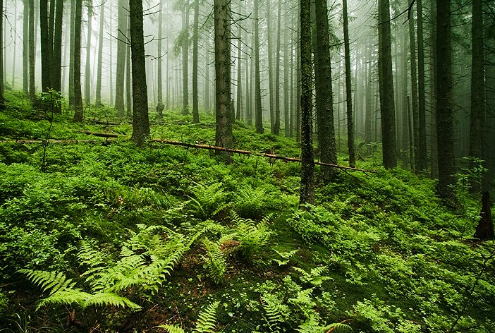
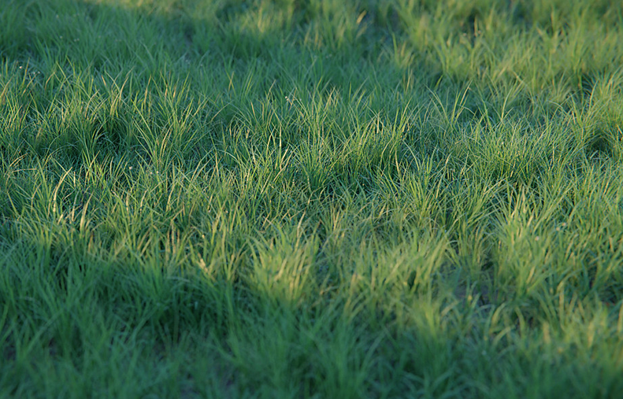
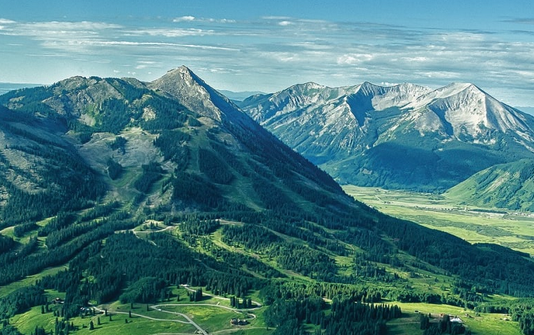
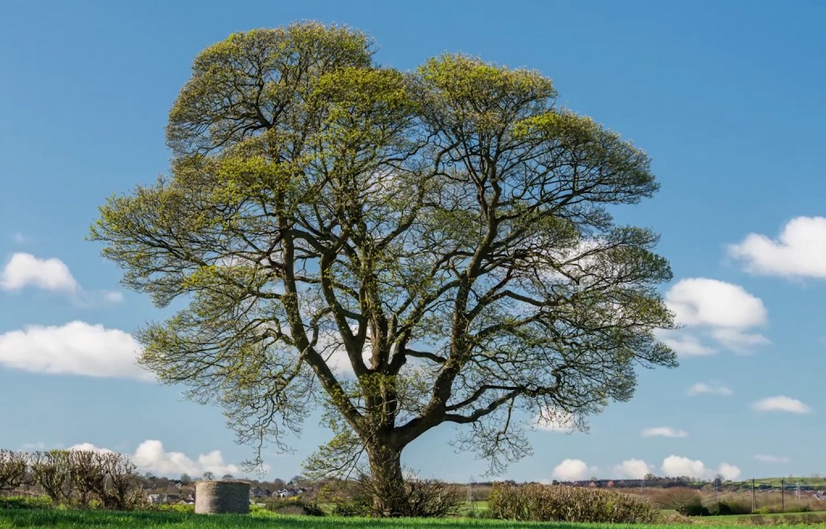
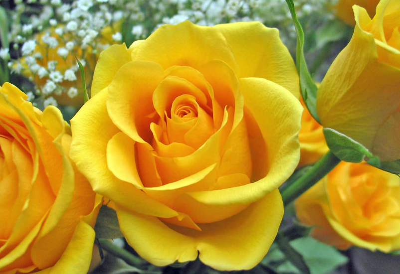

# Week 6 Nature

## 1 - What is it?

* It is a ...

## 2 - What can you see?

| ##|   Q| A|MEMO|
|---|---|---|---|
|  1|**ocean** `['oʊʃn]`|n. `海洋`||
| 1A|What can you see?|I can see an **ocean**.|**ocean** `['oʊʃn]` n. `海洋`|
|  2|**forest** `['fɔːrɪst]`|n. `森林`||
| 2A|What can you see?|I can see a **forest**.|**forest** `['fɔːrɪst]` n. `森林`|
|  3|**grass** `[ɡræs]`|n. `草；草地`||
| 3A|What can you see?|I can see **grass**.|**grass**  `[ɡræs]` n. `草；草地`|
|  4|**mountain** `['maʊntən]`|n. `山`||
| 4A|What can you see?|I can see a **mountain**. |**mountain** `['maʊntən]` n. `山`|
|  5|**tree** `[triː]`|n. `树`||
| 5A|What can you see?|I can see a **tree**.|**tree**  `[triː]` n. `树`|
|  6|**flower** `['flaʊər]`|n. `花`||
| 6A|What can you see?|I can see a **flower**.|**flower**  `['flaʊər]`  n. `花`|

**NOTE**
1. `grass`前面不加任何冠词。
1. `ocean`前面的不定冠词是`an`。(**a**置于**辅音**之前，**an**置于**元音**之前。)

## 3 - Language in my world

* Watch out.  `当心`
* Be careful. `小心`

## 4 - 阅读书上46-54页。字母A-H的发音。
