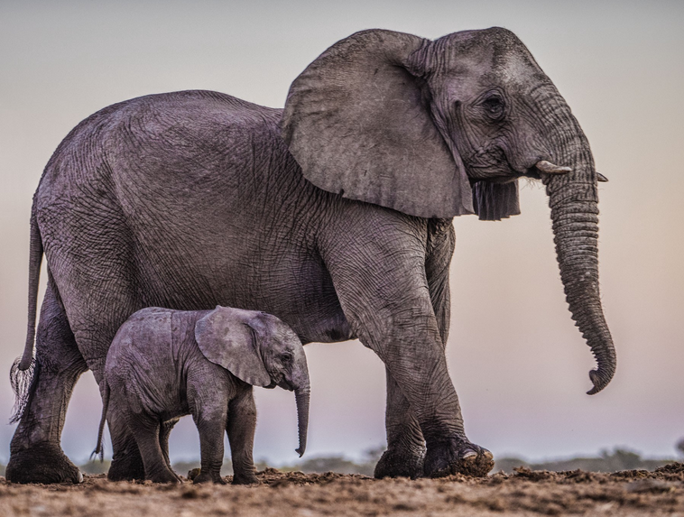
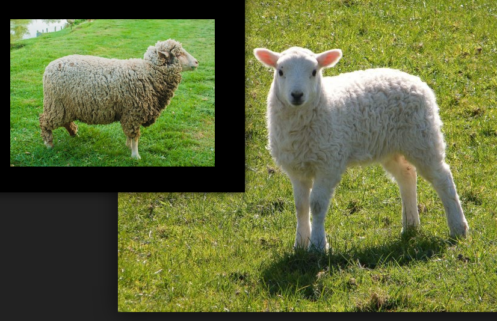
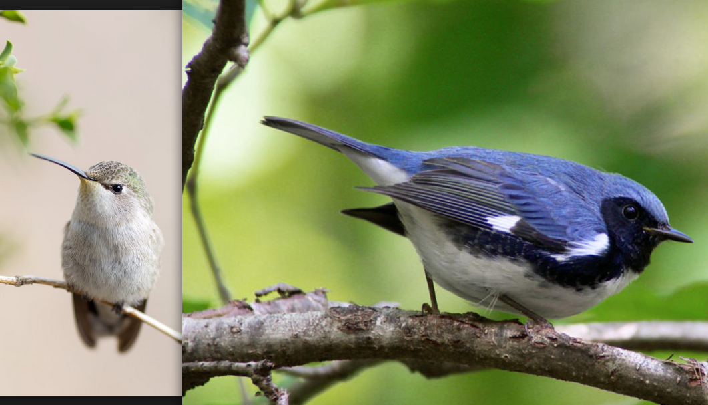
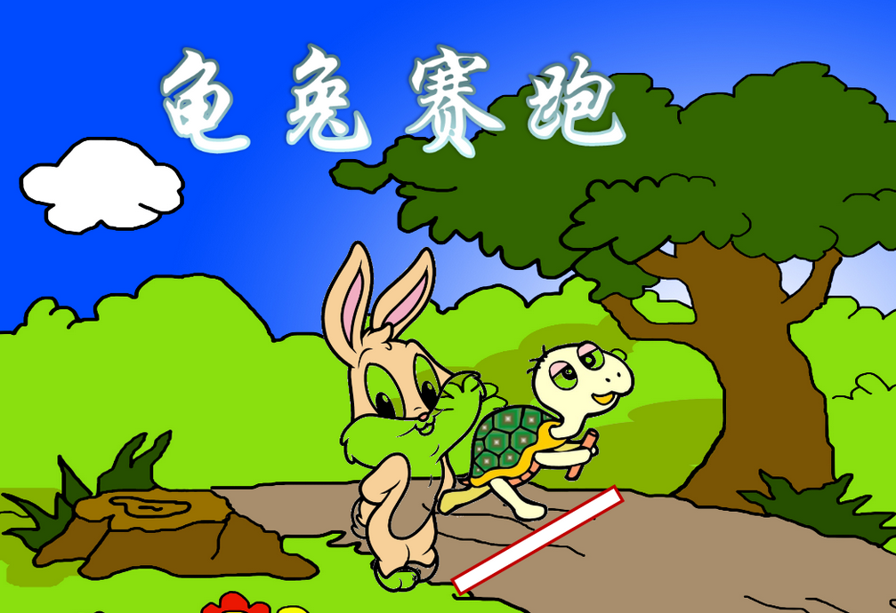
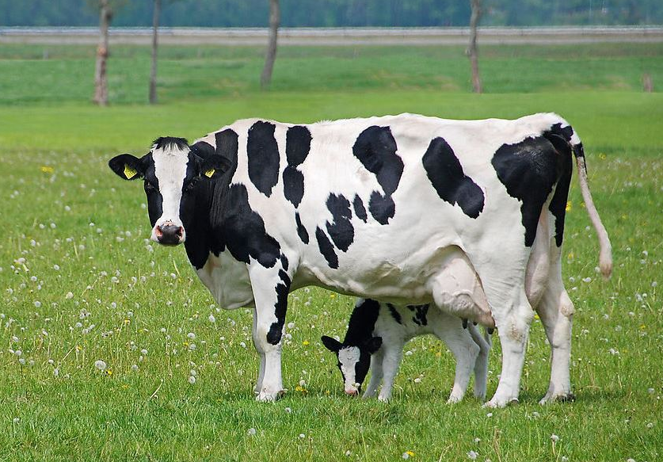

# Week 8 Magic World

## 1 - What is it?

* It is a ...

## 2 - What can you see?

| ##|   Q| A|MEMO|
|---|---|---|---|
|  1|**elephant** `['elɪfənt]` |n. `大象`||
| 1A|What can you see?|I can see a **big** elephant.|**big** `[bɪɡ]` adj. `大的`|
| 1B|What can you see?|I can see a **small** elephant.|**small** `[smɔːl]` adj. `小的`|
|  2|**sheep** `[ʃiːp]` |n. `绵羊`||
| 2A|What can you see?|I can see a **clean** sheep.|**clean** `[kliːn]` adj. `干净的`|
| 2B|What can you see?|I can see a **dirty** sheep.|**dirty** `['dɜːrti]` adj. `脏的`|
|  3|**bird** `[bɜːrd]` |n. `x`||
| 3A|What can you see?|I can see a **fat**  bird.|**fat**  `[fæt]` adj. `肥胖的`|
| 3B|What can you see?|I can see a **thin** bird.|**thin** `[θɪn]` adj. `瘦的`|
|  4|**rabit** `[ræ'bɪt]` n. 兔|**turtle** `['tɜːrtl]` n. 海龟||
| 4A|What can you see?|I can see a **fast** rabit. |**fast** `[fæst]` adj. `快的`|
| 4B|What can you see?|I can see a **slow** turtle.|**slow** `[sloʊ]` adj. `慢的`|
|  5|**cow** `[kaʊ]`  |n. `奶牛`||
| 5A|What can you see?|I can see a **tall**  cow.|**tall**  `[tɔːl]`  adj. `高的`|
| 5B|What can you see?|I can see a **short** cow.|**short** `[ʃɔːrt]` adj. `矮的`|

## 3 - Language in my world

* Hurry up.  `快点儿`
* Come on. `过来`

## 4 - 阅读书上64-72页。字母A-K的发音。
