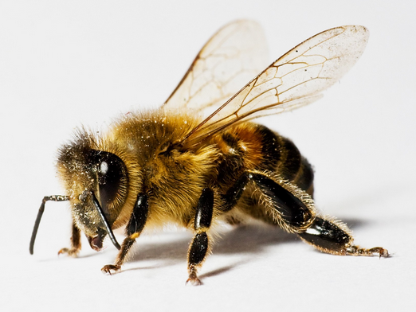
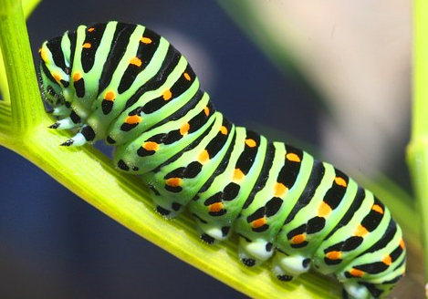
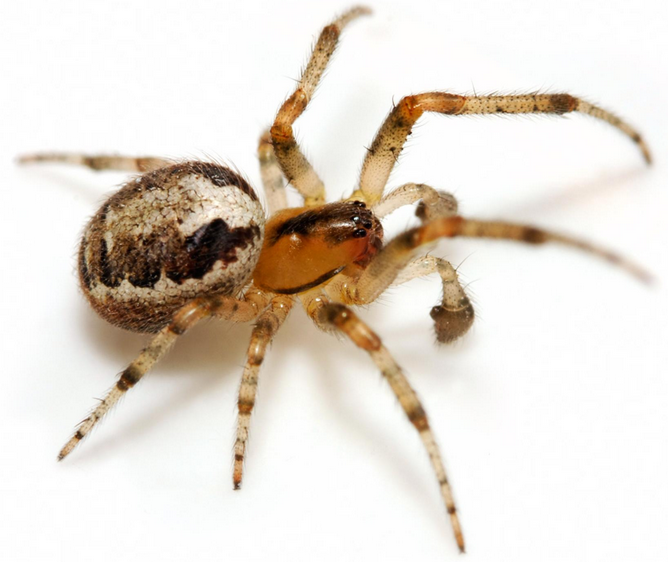
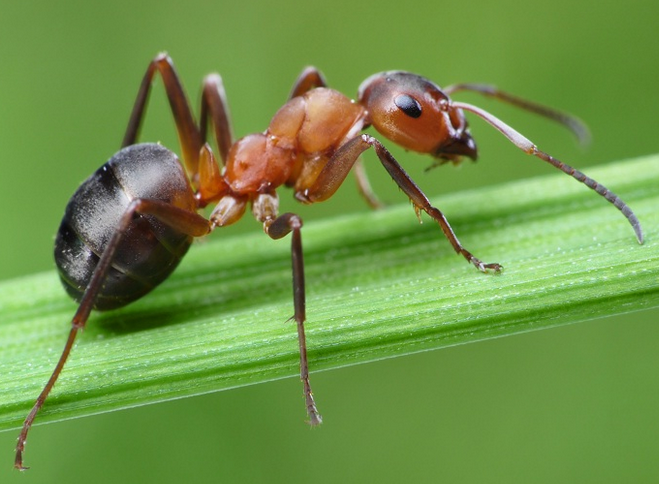
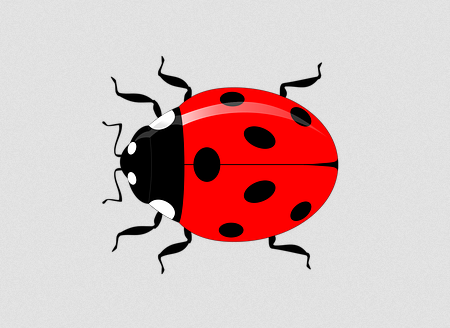

# Week 12 Bugs

## 1 - Can you count?

* One, two, three, ... (animal)

## 2 - 句型练习

1. **What can you see?**
   * **I can see a** butterfly/bee/... .
1. **How many** legs **can you see?**
   * **I can see** six/eight/... **legs**.

| ##|   Q| A|MEMO|
|---|---|---|---|
|  1||**butterfly**|`蝴蝶`|
| 1A|What can you see?|I can see a **butterfly**.|**butterfly** `['bʌtərflaɪ]` n. `蝴蝶`|
| 1B|How many legs can you see?|I can see six legs.||
|  2||**bee**|`蜜蜂`|
| 2A|What can you see?|I can see a **bee**.|**bee** `[biː]` n. `蜜蜂`|
| 2B|How many legs can you see?|I can see six legs.||
|  3||**caterpillar**|`毛毛虫`|
| 3A|What can you see?|I can see a **caterpillar**.|**caterpillar** `['kætәpilә]` n. `毛毛虫`|
| 3B|How many legs can you see?|I can see ten legs.||
|  4||**spider**|`蜘蛛`|
| 4A|What can you see?|I can see a **spider**.|**spider** `['spaidә]` n. `蜘蛛`|
| 4B|How many legs can you see?|I can see eight legs.||
|  5||**ant**|`蚂蚁`|
| 5A|What can you see?|I can see an **ant**.|**ant** `[ænt]` n. `蚂蚁`|
| 5B|How many legs can you see?|I can see six legs.||
|  6||**ladybug**|`七星瓢虫`|
| 6A|What can you see?|I can see a **ladybug**.|**ladybug** `['leidibʌg]` n. `七星瓢虫`|
| 6B|How many legs can you see?|I can see six legs.||

## 3 - Language in my world

* Good morning.   `早上好`
* Good afternoon. `下午好`
* Good evening.   `晚上好`

## 4 - 阅读书上100-108页。字母P,Q的发音。
