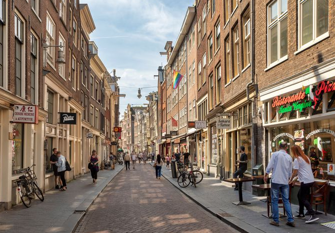
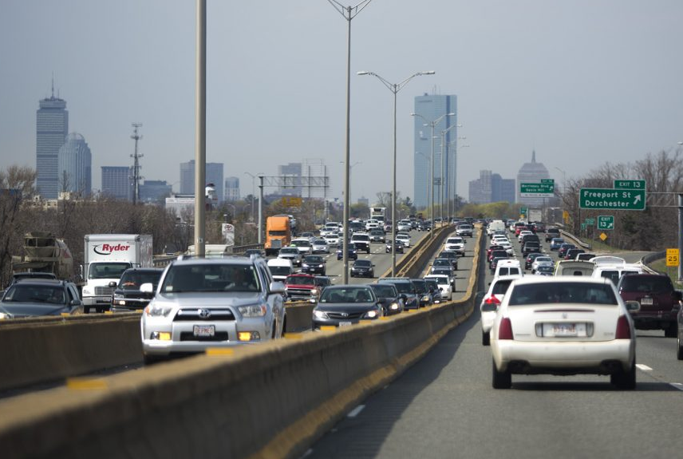
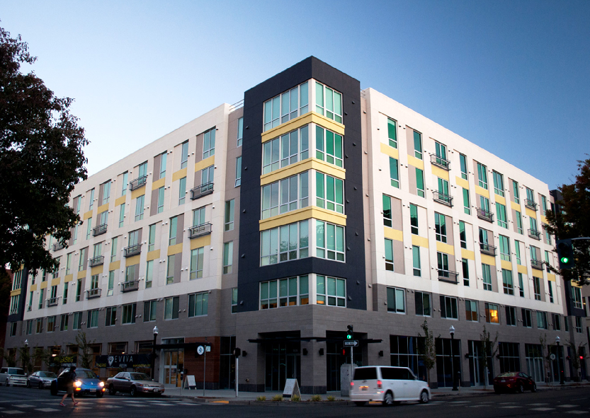
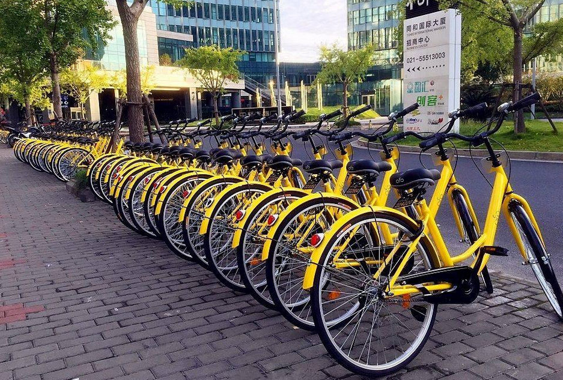
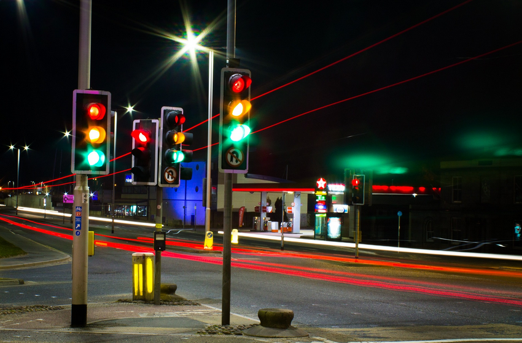

# Week 13 The City

## 1 - What is it?

* It is ...

## 2 - 句型练习

1. **What can you see?**
   * **I can see** the street/the cars/a building/... .

| ##|   Q| A|MEMO|
|---|---|---|---|
|  1||**street**|n. `街道，马路`|
| 1A|What can you see?|I can see the **street**.|**street** `[striːt]` n. `街道，马路`|
|  2||**car**|n. `汽车，轿车`|
| 2A|What can you see?|I can see the **cars**.|**car** `[kɑːr]` n. `汽车，轿车`|
|  3||**building**|n. `建筑物`|
| 3A|What can you see?|I can see a **building**.|**building** `['bɪldɪŋ]` n. `建筑物`|
|  4||**subway**|n. `地铁` (注：美式英语中用**metro** `['metroʊ]`)|
| 4A|What can you see?|I can see the **subway**.|**subway** `['sʌbweɪ]` n. `地铁`|
|  5||**bike** or **bicycle**|n. `自行车`|
| 5A|What can you see?|I can see the **bikes**.|**bike** `[baɪk]` n. `自行车` **bicycle** `['baɪsɪkl]`|
|  6||**stoplight**|n. `红绿灯`|
| 6A|What can you see?|I can see the **stoplight**.|**stoplight** `['stɒpˌlɑɪt]]` n. `红绿灯`|

## 3 - Language in my world

* Time for bed. `该睡觉了`
* Good night.   `晚安`

## 4 - 阅读书上109-119页。字母R的发音。
