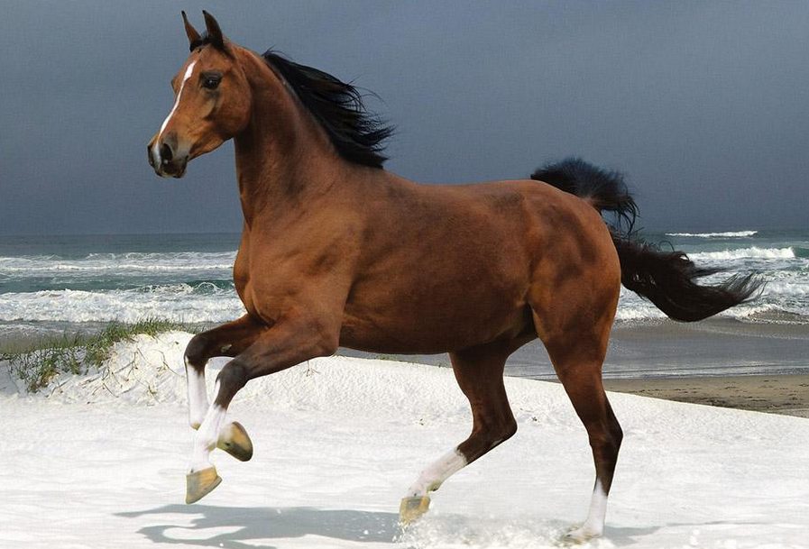
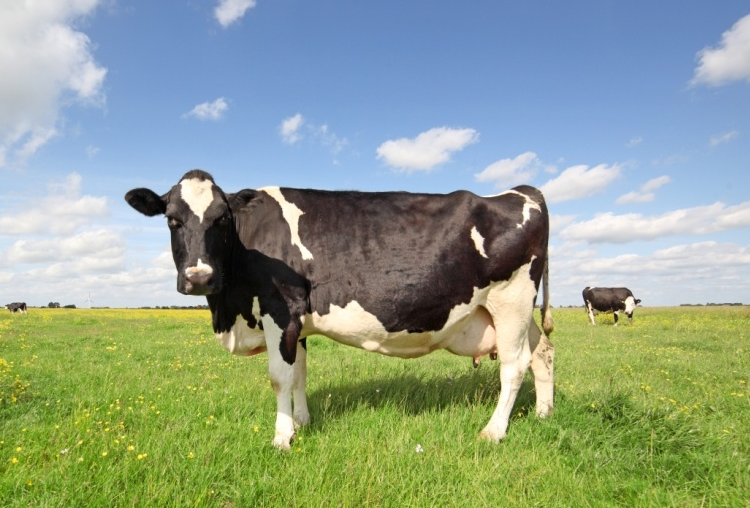
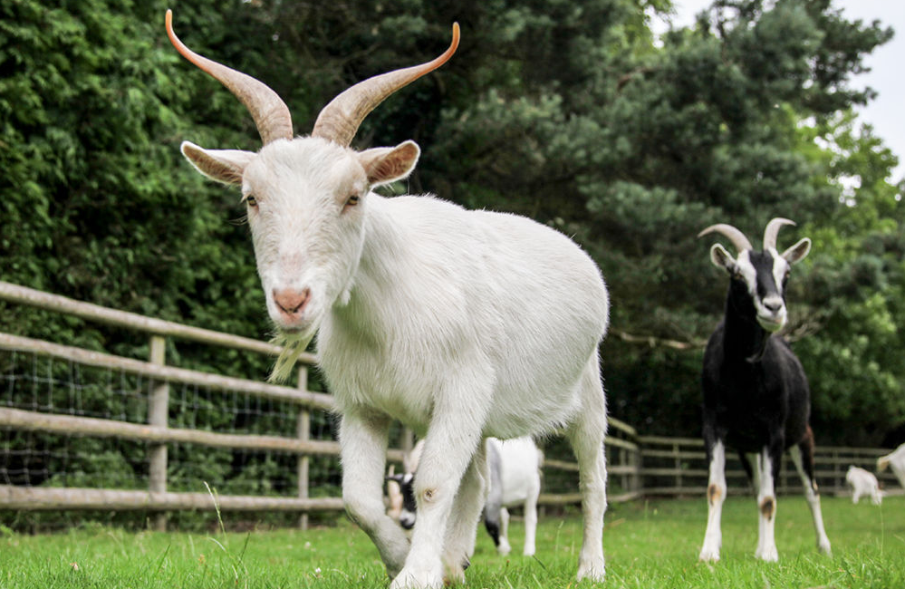
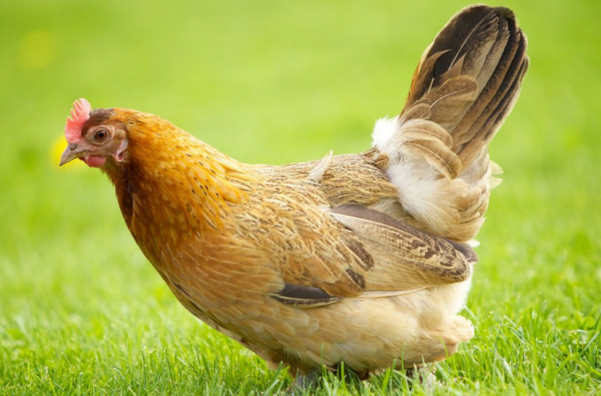
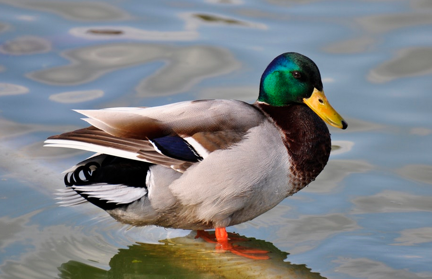
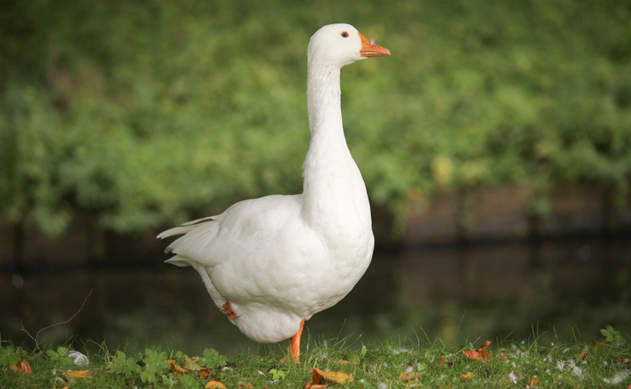
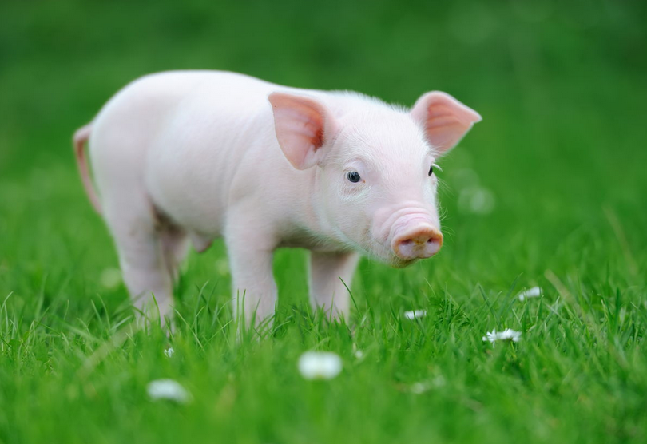
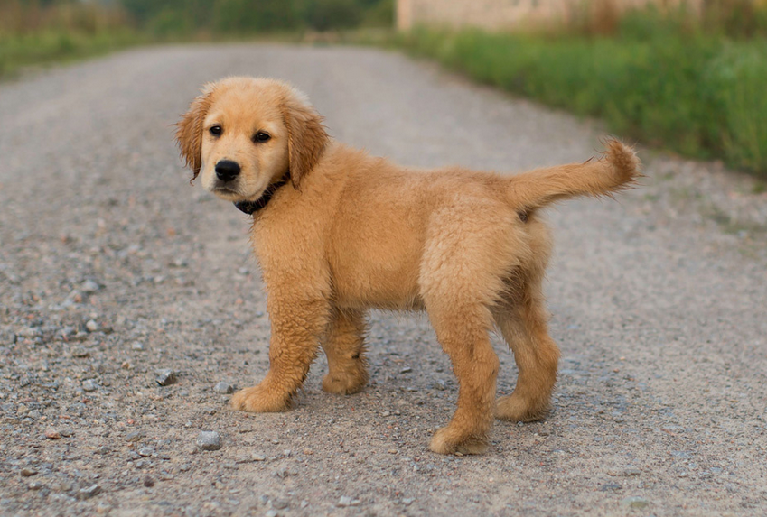

# Week 11 Farm Animal

## 1 - Can you count?

* One, two, three, ... (animal)

## 2 - 句型练习

1. **What is it?**
   * **It is a** cow/goat/... .
1. **What farm animal can you see?**
   * **I can see a** cow/goat/... .
1. **What sound do** cows/goats/... **make?**
   * Cows/Goats/... **go** ... .

| ##|   Q| A|MEMO|
|---|---|---|---|
|  1|**horse**|n. `马`||
| 1A|What is it?|It is a **horse**.|**horse** `[hɔːrs]` n. `马`|
| 1B|What farm animal can you see?|I can see a **horse**.||
| 1C|What sound do **horses** make?|**Horses** go **neigh**.|**neigh** `[nei]` vi. `马嘶` n. `马嘶声`|
| ==|||
|  2|**cow**|n. `奶牛`||
| 2A|What is it?|It is a **cow**.|**cow** `[kau]` n. `奶牛`|
| 2B|What farm animal can you see?|I can see a **cow**.||
| 2C|What sound do **cows** make?|**Cows** go **moo**.|**moo** `[mu:]` vi. `发哞声` n. `牛叫声`|
| ==|||
|  3|**goat**|n. `山羊`||
| 3A|What is it?|It is a **goat**.|**goat** `[ɡoʊt]` n. `山羊`|
| 3B|What farm animal can you see?|I can see a **goat**.||
| 3C|What sound do **goats** make?|**Goats** go **mie**.|**mie** |
| ==|||
|  4|**hen**|n. `母鸡`||
| 4A|What is it?|It is a **hen**.|**hen** `[hen]` n. `母鸡`|
| 4B|What farm animal can you see?|I can see a **hen**.||
| 4C|What sound do **hens** make?|**Hens** go **cluck**.|**cluck** `[klʌk]` vi. `咯咯叫` n. `(母鸡的)咯咯叫声`|
| ==|||
|  5|**duck**|n. `鸭`||
| 5A|What is it?|It is a **duck**.|**duck** `[dʌk]` n. `鸭`|
| 5B|What farm animal can you see?|I can see a **duck**.||
| 5C|What sound do **ducks** make?|**Ducks** go **quack**.|**quack** `[kwæk]` vi. `嘎嘎叫` n. `鸭叫声`|
| ==|||
|  6|**goose**|n. `鹅`||
| 6A|What is it?|It is a **goose**.|**goose** `[gu:s]` n. `鹅`; **geese** `[gi:s]` `鹅的复数`|
| 6B|What farm animal can you see?|I can see a **goose**.||
| 6C|What sound do **geese** make?|**Geese** go **honk**.|**honk** `[hɑːŋk]` n. `雁(wild goose) 的叫声`|
| ==|||
|  7|**pig**|n. `猪`||
| 7A|What is it?|It is a **pig**.|**pig** `[pig]` n. `猪`|
| 7B|What farm animal can you see?|I can see a **pig**.||
| 7C|What sound do **pigs** make?|**Pigs** go **oink**.|**oink** `[ɔɪŋk]` n. `猪叫声`|
| ==|||
|  8|**dog**|n. `狗`||
| 8A|What is it?|It is a **dog**.|**dog** `[dɔːɡ]` n. `狗`|
| 8B|What farm animal can you see?|I can see a **dog**.||
| 8C|What sound do **dogs** make?|**Dogs** go **woof**.|**woof** `[wu:f]` n. `狗低吠声`|

## 3 - Language in my world

|#|Q|A|MEMO|
|---|---|---|---|
| 1 |Is it **big**?  |**Yes, it is**.  |**big**   `[bɪɡ]`   adj. `大的`|
|   |                |**No, it isn't**.||
| 2 |Is it **small**?|**Yes, it is**.  |**small** `[smɔːl]` adj. `小的`|
|   |                |**No, it isn't**.||

## 4 - 阅读书上91-99页。字母A-O的发音。
