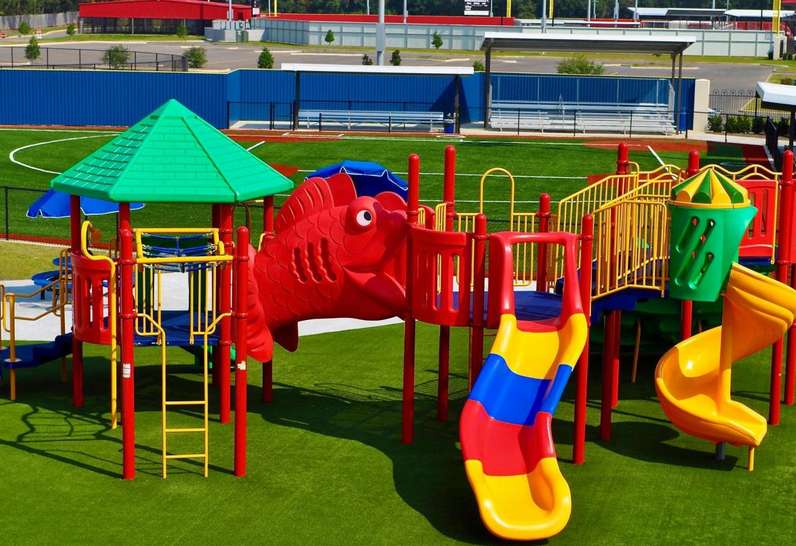
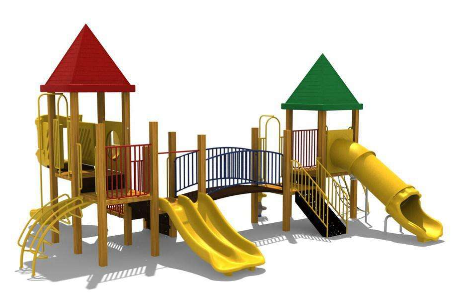
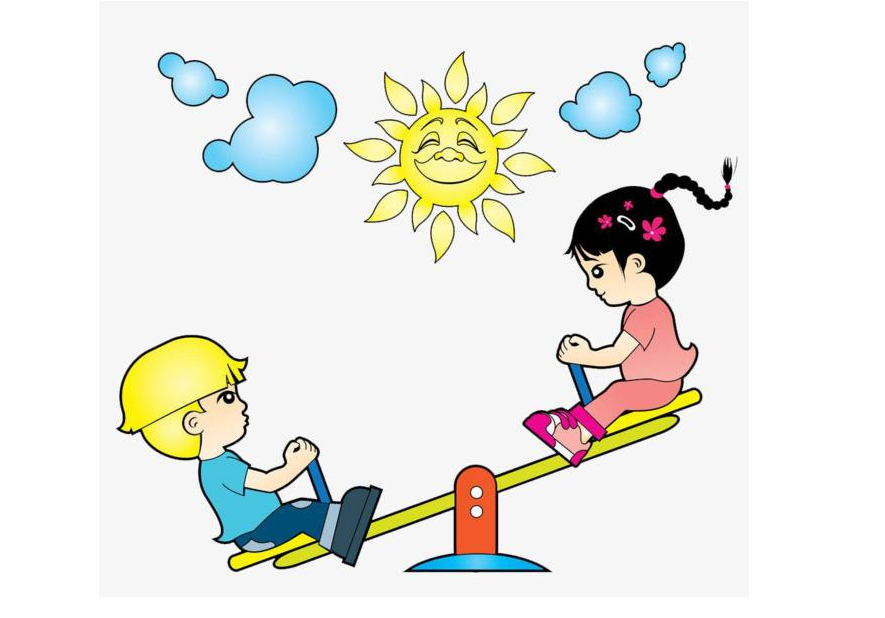
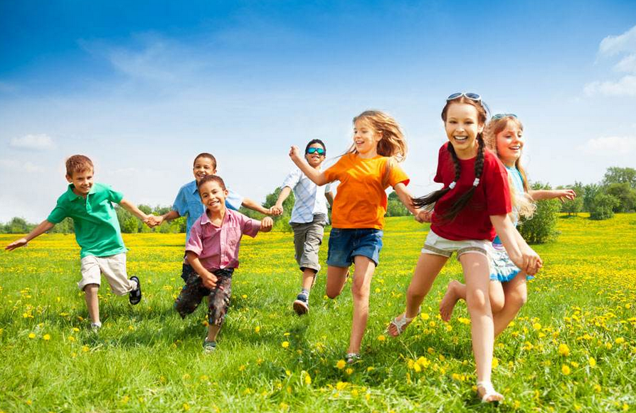
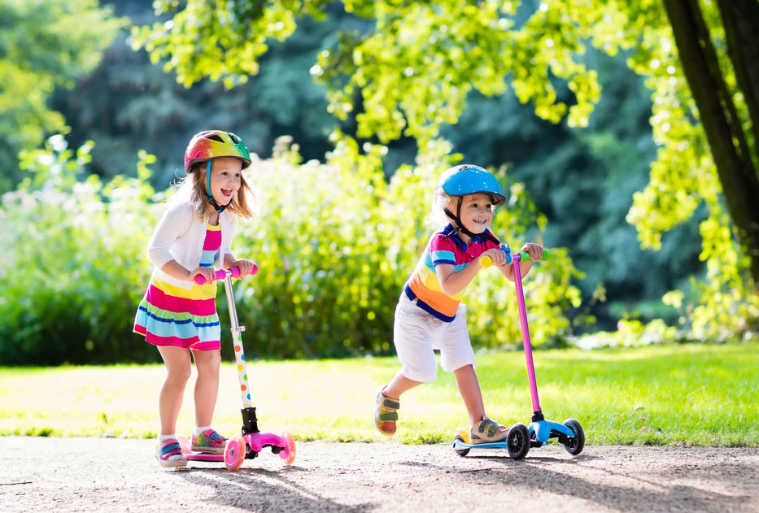

# Week 14 Fun Time

## 1 - 单词

|#ID|单词|音标|含义|
|---|:---|:---|:---|
|1|**playground**|`['pleɪɡraʊnd]` |n. `操场；运动场；游乐场`|
|2|**slide**     |`[slaɪd]`       |n. `滑梯`|
|3|**seesaw**    |`['siːˌsɔː]`    |n. `跷跷板`|
|4|**friend**    |`[frend]`       |n. `朋友`|
|5|**scooter**   |`['skuːtər]`    |n. `滑板车`|
|6|**ride**      |`[raɪd]`        |v. `骑；乘`|

## 2 - 句型练习

1. **What do you do for fun?**
   * **I** ... **for fun**.

| ##|   Q| A|MEMO|
|---|---|---|---|
|  1||**playground**|n. `操场；运动场；游乐场`|
| 1A|What do you do for fun?|I **go to the playground** for fun.|**playground** `['pleɪɡraʊnd]` n. `操场；运动场；游乐场`|
|  2||**slide**|n. `滑梯`|
| 2A|What do you do for fun?|I **go down the slide** for fun.|**slide** `[slaɪd]` n. `滑梯`|
|  3||**seesaw**|n. `跷跷板`|
| 3A|What do you do for fun?|I **go on the seesaw** for fun.|**seesaw** `['siːˌsɔː]` n. `跷跷板`|
|  4||**friend**|n. `朋友`|
| 4A|What do you do for fun?|I **play with my friends** for fun.|**friend** `[frend]` n. `朋友`|
|  5||**scooter**|n. `滑板车`|
| 5A|What do you do for fun?|I **ride my scooter** for fun.|**scooter** `['skuːtər]` n. `滑板车`|

## 3 - Language in my world

* Let's have fun! `我们一起玩吧`
* Hurray! `[hə'reɪ]` int. `(表示欢喜、鼓舞、赞成等)好哇`

## 4 - 阅读书上120-126页。字母J-R的发音。
