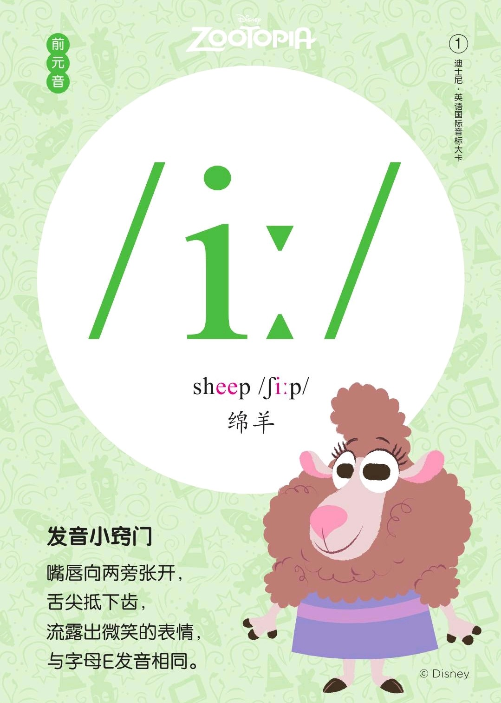
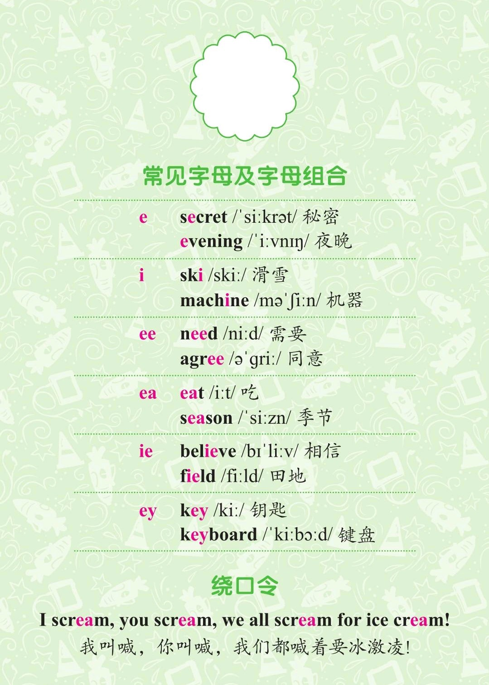
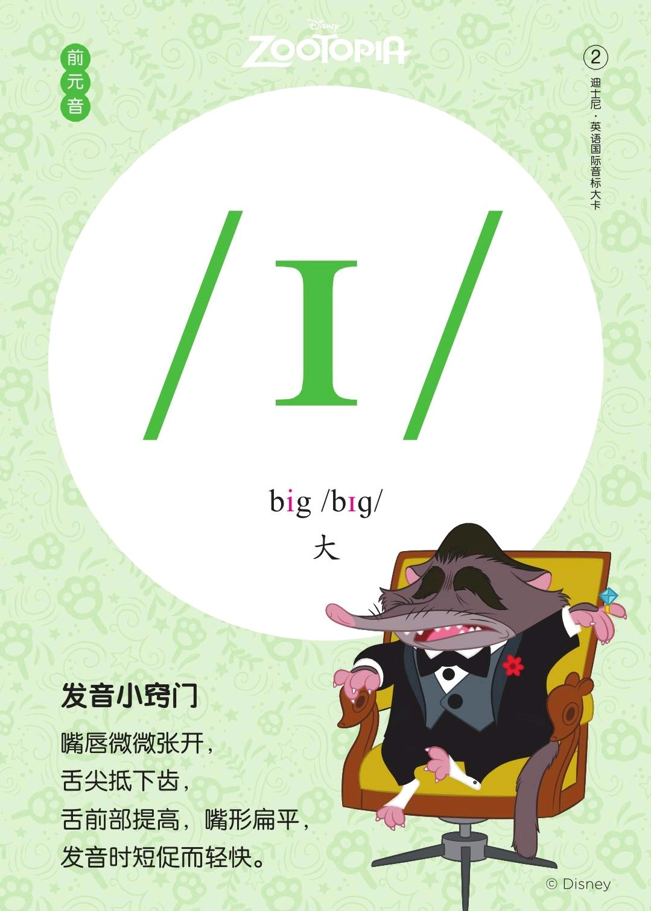

###### [返回到主页](README.md)

# 第一讲 [单元音\[i:\]][RE01]和[单元音\[ɪ\]][RE02]

[RE01]: https://rachelsenglish.com/english-pronounce-ee-vowel/ 
[RE02]: https://rachelsenglish.com/english-pronounce-ih-vowel/

|   ID|IPA     |KK     |IPA63 |
|:---:|:-------|:------|:-----|
|   01|[**i:**]|[**i**]|`[i:]`|
|   02|[**ɪ**] |[**ɪ**]|`[i]` |
-------------------------------------------------------------------------------
|||
|:--------------------------:|:--------------------------:|
|||
|||
|||

## 1 - 单元音[i:]  

### 1.1 发音方法
* 发音时舌尖轻抵下齿，前舌部向上腭抬起，口型扁而平。
* 发音时间延续较长。

### 1.2 音标特征
* 前元音 舌位高 不圆唇 长元音

## 2 - 单元音[ɪ]

### 2.1 发音方法
* 发音时舌尖抵下齿，舌前部向硬腭尽量抬起，抬起高度比[i:]低，口型扁而平。
* 发音时间短促。

### 2.2 音标特征
* 前元音 半高音 扁平唇 短元音

### 2.3 特别说明
* [ɪ]在IPA63中记号为[i]；
* [i]和[ɪ]都是[i:]的短音，但发音略有不同，**[ɪ]发音介乎短音的[i]和[e]之间，
  发音秘诀是用[e]的口型发短音的[i]**；
* 现代音标里习惯于将两个音笼统地记为[i]，具体发音则由其在单词中的位置决定；
  但是，**新版英汉双解词典(例如：朗文多功能英汉双解词典 第五版)里既使用[i]又
  使用[ɪ]**。

## 3 - 参考资料
* [Rachel's English][C01] and [Rachel's English美式音标/i/][C02] and [Rachel's English美式音标/ɪ/][C03]
* [美式音标发音（含口型）：元音 /i/ 和 /ɪ/ 的区别][C04]
* [IPA、DJ、KK音标的起源和联系区别][C05]

[C01]: https://rachelsenglish.com/
[C02]: https://www.bilibili.com/video/av33768421?p=8
[C03]: https://www.bilibili.com/video/av33768421?p=9
[C04]: https://www.bilibili.com/video/av57760086?from=search&seid=11813551962596245115
[C05]: http://blog.sina.com.cn/s/blog_a3f822610101ikhl.html

###### [返回到主页](README.md)
