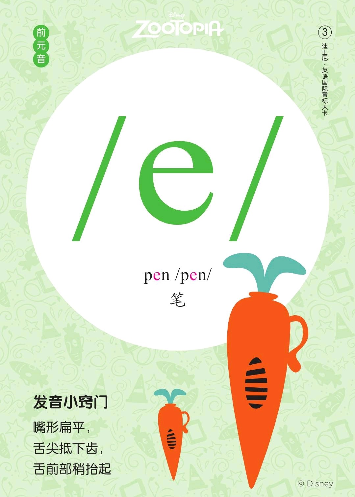
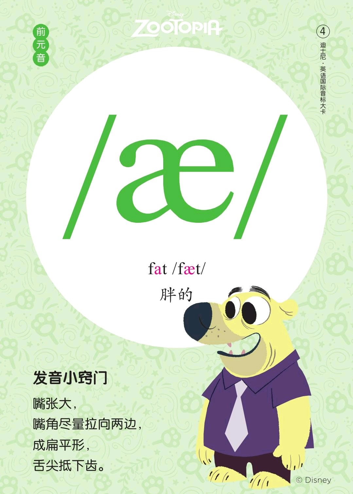
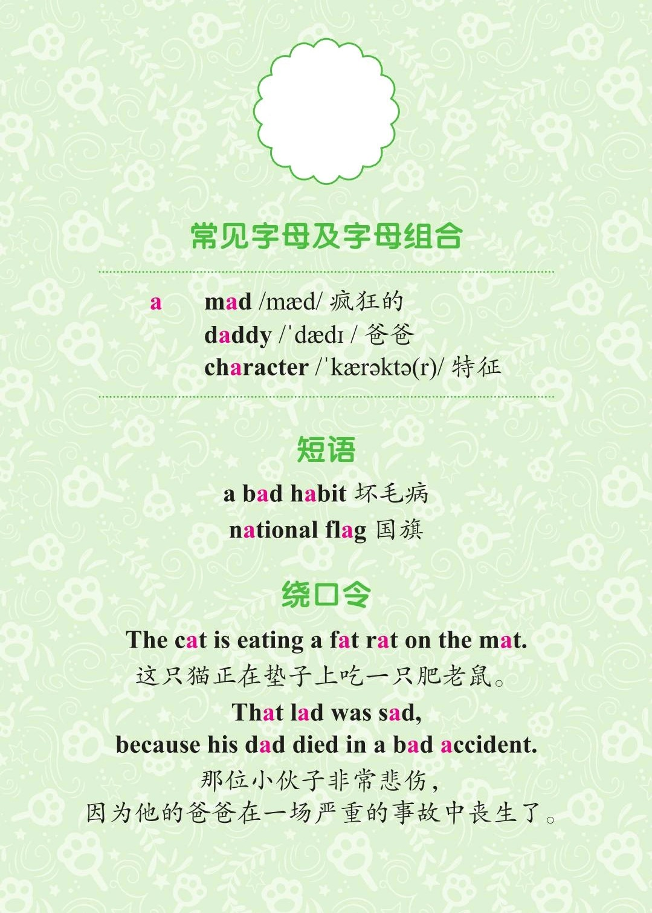

###### [返回到主页](README.md)

# 第二讲 [单元音\[e\]][RE03]和[单元音\[æ\]][RE04]

[RE03]: https://rachelsenglish.com/english-pronounce-eh-vowel/
[RE04]: https://rachelsenglish.com/english-pronounce-aa-ae-vowel/

|   ID|IPA     |KK     |IPA63 |
|:---:|:-------|:------|:-----|
|   03|[**e**] |[`ɛ`]|`[e]` |
|   04|[**æ**] |[`æ`]|`[æ]` |
-------------------------------------------------------------------------------
|||
|:--------------------------:|:--------------------------:|
|||
|||
|||

## 1 - 单元音[e]

### 1.1 发音方法
* 发音时舌尖抵下齿，前舌部向硬腭抬起，口型扁平，气流从口腔泄出，声带振动，
  上下齿之间的距离大约相当于一个食指尖；
* 发音时间短促。

### 1.2 音标特征
* 前元音 半高音 不圆唇 短元音

### 1.3 音标书写
* 在英式音标中的符号为[e]，在美式音标中的符号则为[ɛ]。

## 2 - 单元音[æ]

### 2.1 发音方法
* 发音和[e]的音非常相似，舌尖抵下齿，前舌部稍抬，双唇开口可容纳食指和中指两个
  手指的宽度；
* 发音时间短促。

### 2.2 音标特征
* 前元音 低舌音 不圆唇 短元音

## 3 - 参考资料
* [Rachel's English][C01]
  and [Rachel's English美式音标/ɛ/][C02]
  and [Rachel's English美式音标/æ/][C03]
* [美式音标发音（含口型）：元音/ɛ/和/æ/元音发音的区别][C04]

[C01]: https://rachelsenglish.com/
[C02]: https://www.bilibili.com/video/av33768421?p=7
[C03]: https://www.bilibili.com/video/av33768421?p=6
[C04]: https://www.bilibili.com/video/av57882316?from=search&seid=7798265331552781492

###### [返回到主页](README.md)
