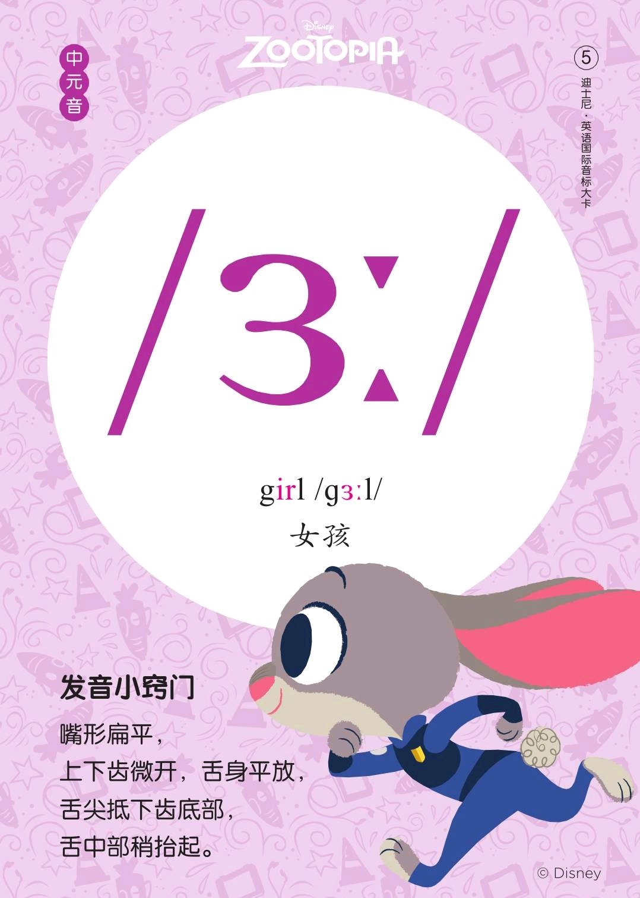
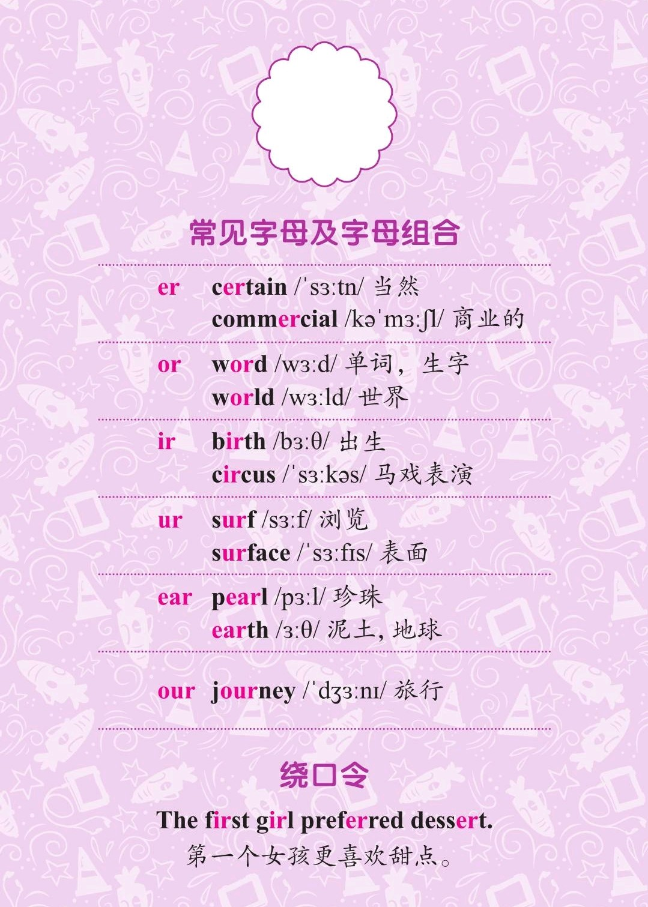
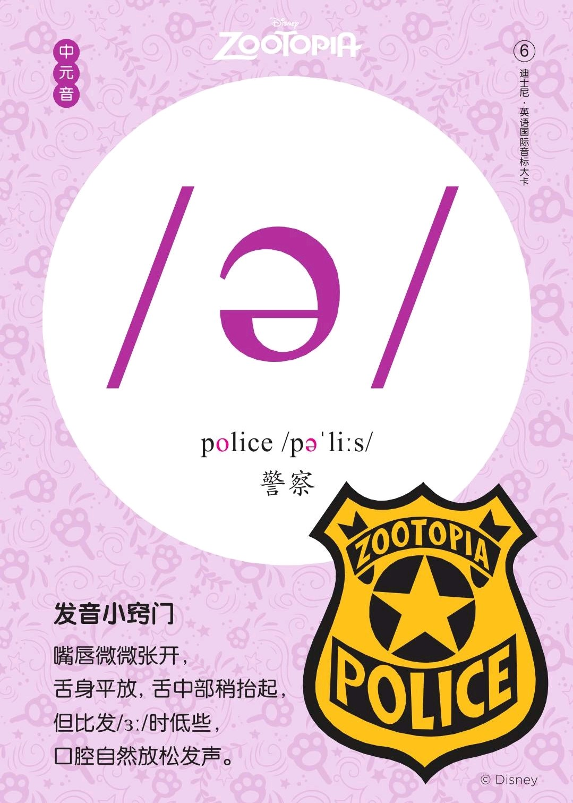

###### [返回到主页](README.md)

# 第三讲 [单元音\[ɜ:\]][RE05]和[单元音\[ə\]][RE06]

[RE05]: https://rachelsenglish.com/english-pronounce-ur-vowel/
[RE06]: https://rachelsenglish.com/english-pronounce-schwa/

|   ID|IPA     |KK     |IPA63 |
|:---:|:-------|:------|:-----|
|   05|**[ɜ:]**|`[ɜ]`  |`[ə:]`|
|   06|**[ə]** |**[ə]**|**[ə]**|
-------------------------------------------------------------------------------
|||
|:--------------------------:|:--------------------------:|
|||
|||
|||

## 1 - 单元音[ɜ:]

### 1.1 发音方法
* 发音位置和[i:]相似；舌位抬高，舌身后缩并放平，口型微张，双唇扁平，
  双唇肌肉稍紧张。

### 1.2 音标特征
* 中元音 半高音 不圆唇 长元音

### 1.3 音标写法
* IPA63写法为[ə:], IPA88写法则为[ɜ:]。

### 1.4 特别说明
* 发音上[ɜ:]是有儿化音的，相当于[ər]；
* IPA63的[ə:]没有儿化音，近似于中文的“呃”(英式发音)。

## 2 - 单元音[ə]

### 2.1 发音方法
* 发音时舌身放平，舌中部抬起，舌位比[ɜ:]略低，口型微开，双唇扁平，
  双唇肌肉放松。

### 2.2 音标特征
* 中元音 半低音 不圆唇 短元音

## 3 - 参考资料
* [Rachel's English][C01]
  and [Rachel's English美式音标/ɜ/][C02]
  and [Rachel's English美式音标/ə/][C03]
* [美式音标发音（含口型）：元音/ə/][C04]
* [美式音标发音（含口型）：元音/ɝ/][C05]
* [美式音标发音（含口型）：元音/ɚ/][C06]

[C01]: https://rachelsenglish.com/
[C02]: https://www.bilibili.com/video/av33768421?p=13
[C03]: https://www.bilibili.com/video/av33768421?p=12
[C04]: https://www.bilibili.com/video/av58135008?from=search&seid=12787804673526657658
[C05]: https://www.bilibili.com/video/av58812524?from=search&seid=15243227748961987664
[C06]: https://www.bilibili.com/video/av58812322?from=search&seid=11437308057304372651

###### [返回到主页](README.md)
