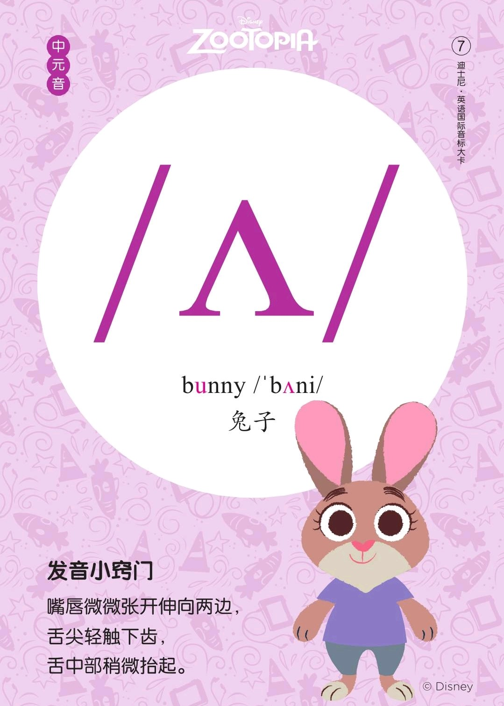
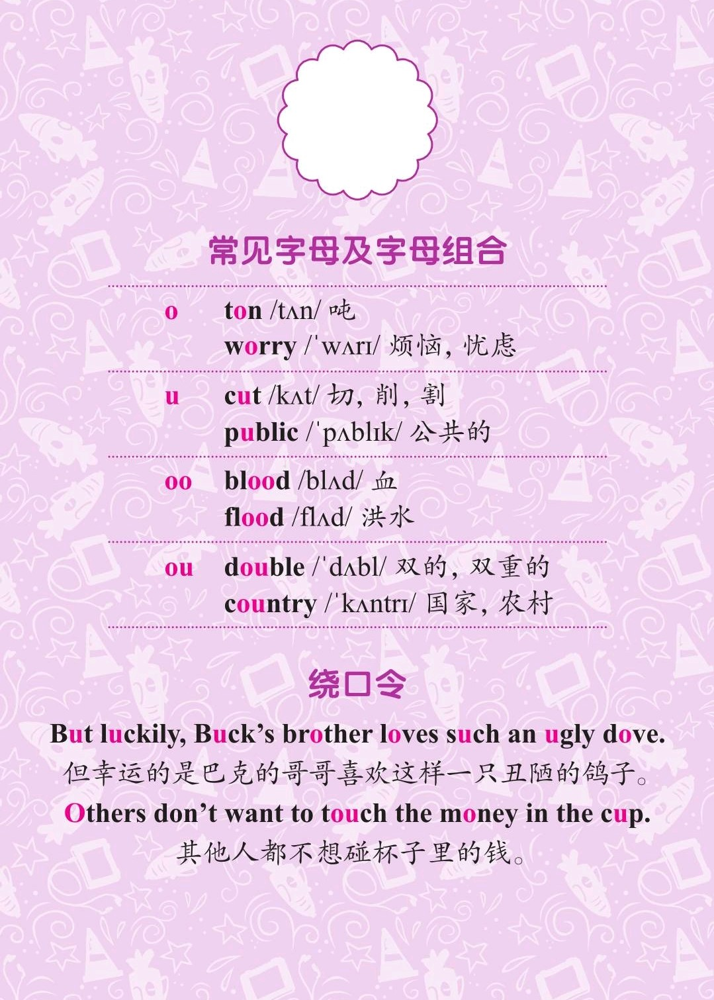
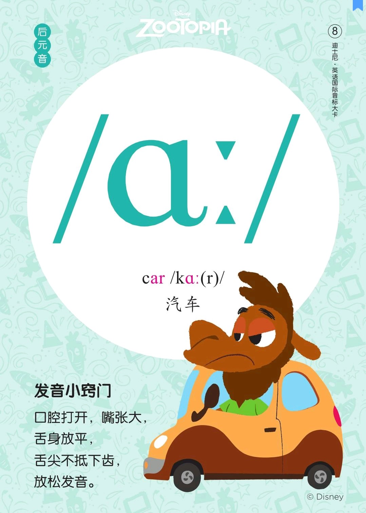
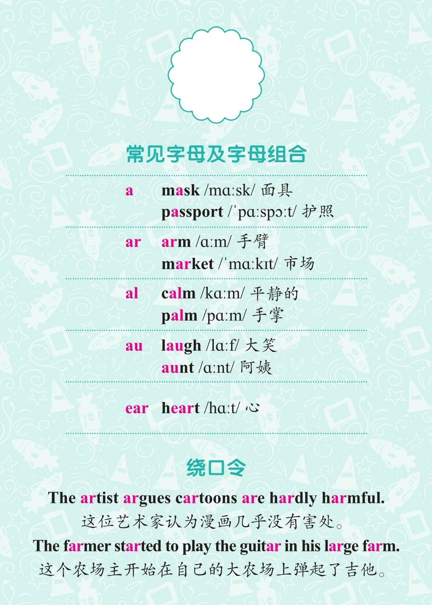

###### [返回到主页](README.md)

# 第四讲 [单元音\[ʌ\]][RE07]和[单元音\[ɑ:\]][RE08]

[RE07]: https://rachelsenglish.com/english-pronounce-uh-butter-vowel/
[RE08]: https://rachelsenglish.com/english-pronounce-ah-vowel/

|   ID|IPA     |KK     |IPA63 |
|:---:|:-------|:------|:-----|
|   07|**[ʌ]** |**[ʌ]**|**[ʌ]**|
|   08|**[ɑ:]**|`[ɑ]`  |**[ɑ:]**|
-------------------------------------------------------------------------------
|||
|:--------------------------:|:--------------------------:|
|||
|||
|||

## 1 - 单元音[ʌ]

### 1.1 发音方法
* 双唇平放，牙床半开，开口程度和[æ]相似，双唇向两旁平伸

### 1.2 音标特征
* 中元音 半低音 不圆唇 短元音

## 2 - 单元音[ɑ:]

### 2.1 发音方法
* 舌身微离下齿，牙床大开，口张大，双唇张开而不圆；
* 记得**要将嘴巴尽量张大，无比夸张**。

### 2.2 音标特征
* 后元音 低音 不圆唇 长元音

## 3 - 参考资料
* [Rachel's English][C01]
  and [Rachel's English美式音标/ʌ/][C02]
  and [Rachel's English美式音标/ɑ/][C03]
* [美式音标发音（含口型）：/ʌ/和/ɑ/发音的区别][C04]

[C01]: https://rachelsenglish.com/
[C02]: https://www.bilibili.com/video/av33768421?p=3
[C03]: https://www.bilibili.com/video/av33768421?p=4
[C04]: https://www.bilibili.com/video/av57761737?from=search&seid=17292373024923783512

###### [返回到主页](README.md)
