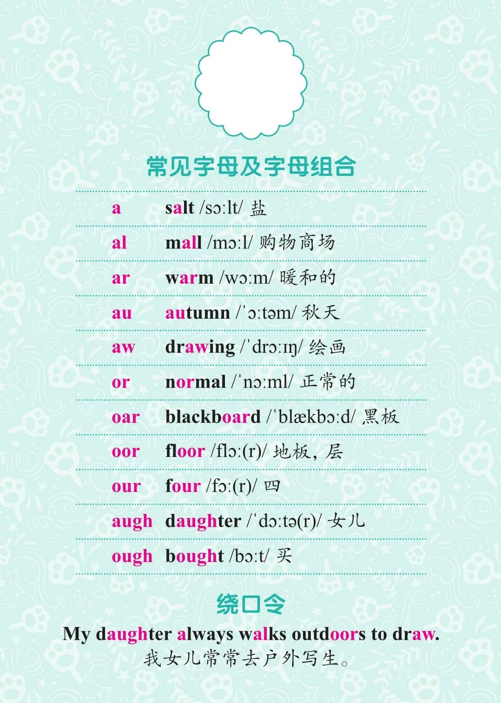
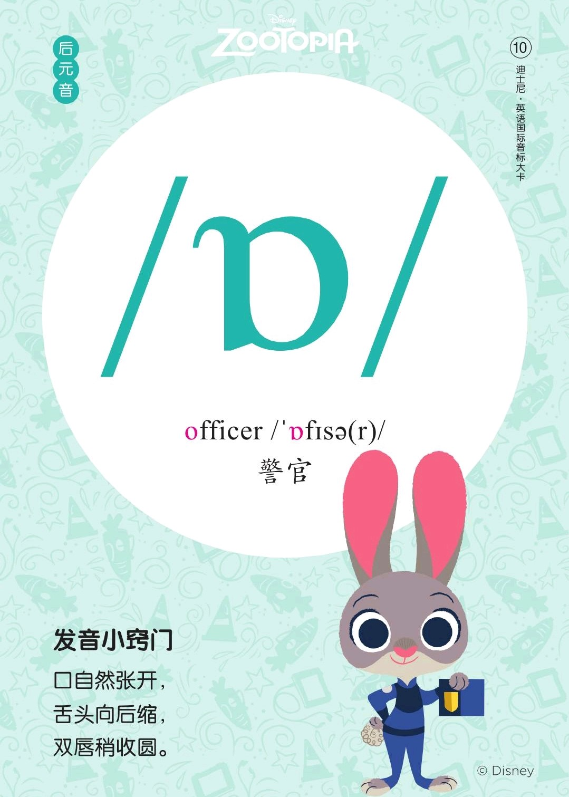
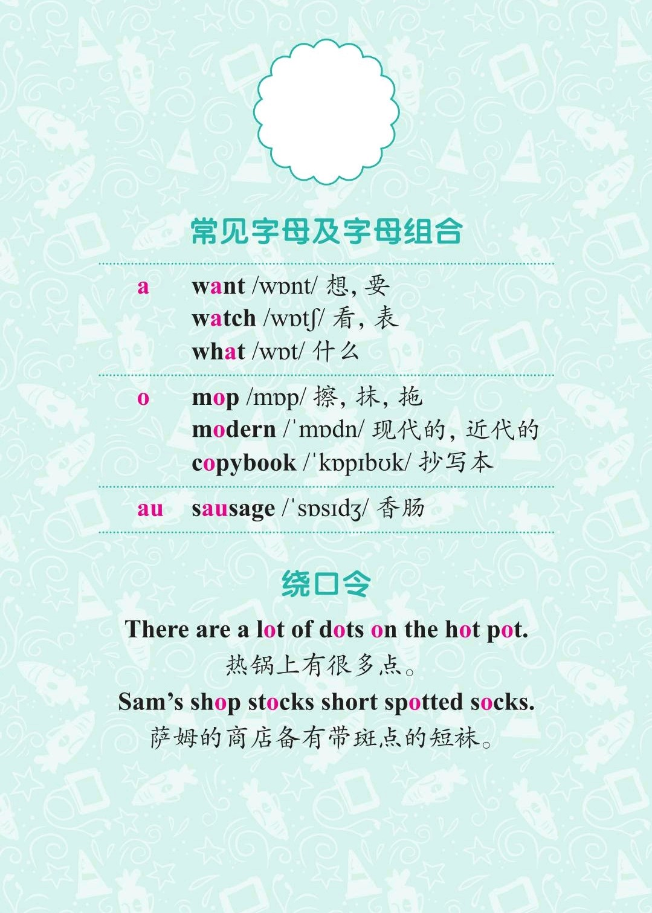

###### [返回到主页](README.md)

# 第五讲 单元音[ɔ:]和单元音[ɒ]

|   ID|IPA     |KK     |IPA63 |
|:---:|:-------|:------|:-----|
|   09|**[ɔ:]**|`[ɔ]`|**[ɔ:]**|
|   10|**[ɒ]** |`[ɑ]`|`[ɔ]`|
-------------------------------------------------------------------------------
|||
|:--------------------------:|:--------------------------:|
|||
|||
|||

## 1 - 单元音[ɔ:]

### 1.1 发音方法
* 双唇向外突出成圆形，稍稍收圆，介于开闭圆唇之间。

### 1.2 音标特征
* 后元音 半低音 圆唇 长元音

## 2 - 单元音[ɒ]

### 2.1 发音方法
* 口张大，舌身尽量降低并后缩，舌端离下齿，舌身低平后缩，舌后部稍抬高。

### 2.2 音标特征
* 后元音 低音 圆唇 短元音

### 2.3 音标书写
* IPA88中书写为[ɒ]；而在IPA63中书写为[ɔ]。二者发音一样。

## 3 - 参考资料
* [Rachel's English][C01]
  * [English: How to Pronounce AW [ɔ] Vowel][C02]
  * [English: How to Pronounce [ɑ] AH Vowel][C03]

[C01]: https://rachelsenglish.com/
[C02]: https://rachelsenglish.com/english-pronounce-aw-vowel/
[C03]: https://rachelsenglish.com/english-pronounce-ah-vowel/

###### [返回到主页](README.md)
