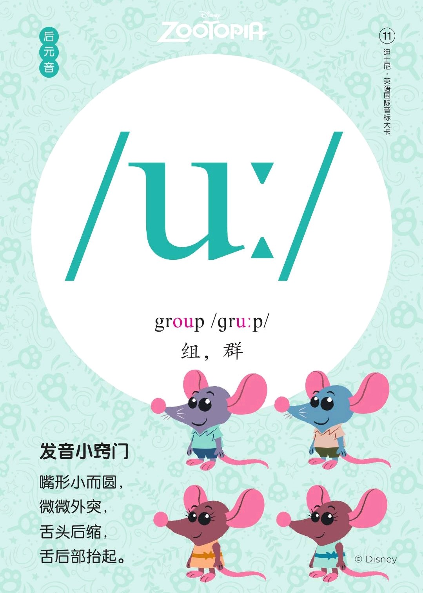
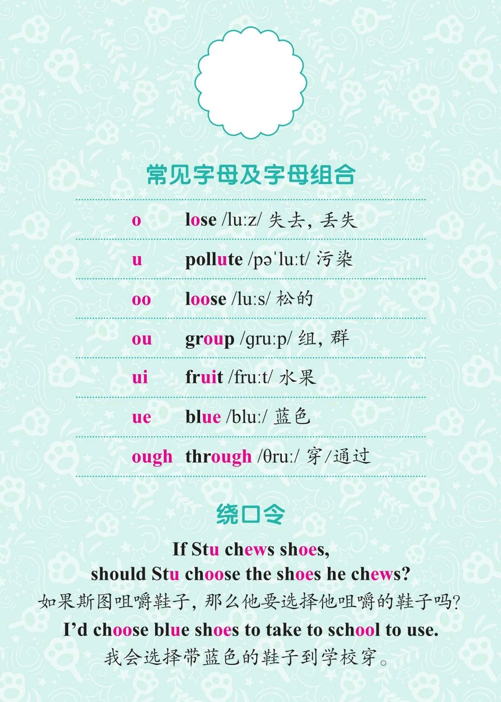
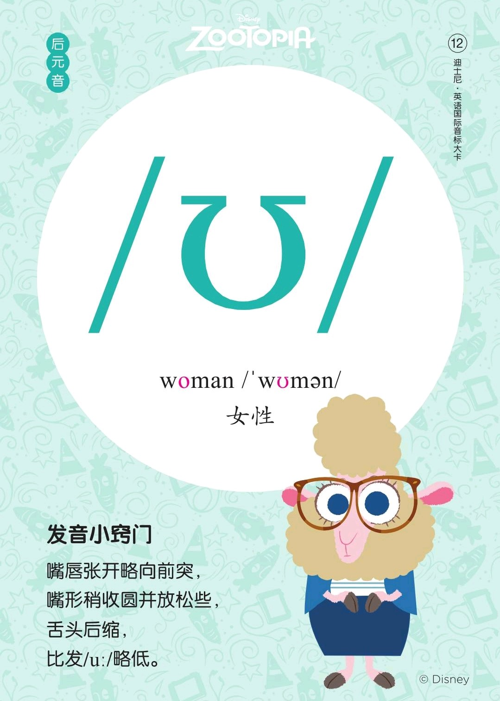
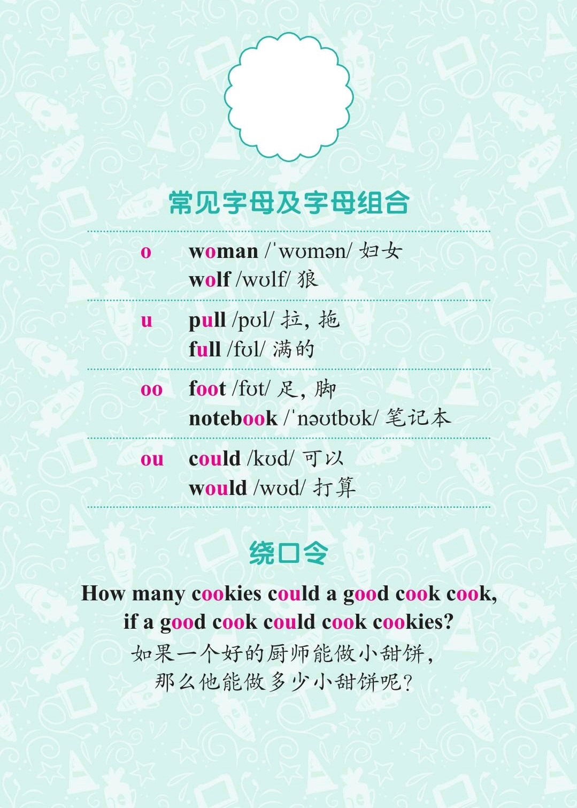

###### [返回到主页](README.md)

# 第六讲 单元音[u:]和单元音[ʊ]

|   ID|IPA     |KK     |IPA63 |
|:---:|:-------|:------|:-----|
|   11|**[u:]**|`[u]`|**[u:]**|
|   12|**[ʊ]** |**[ʊ]**|`[u]`|
-------------------------------------------------------------------------------
|||
|:--------------------------:|:--------------------------:|
|||
|||
|||

## 1 - 单元音[u:]

### 1.1 发音方法
* 舌身后缩，舌后部尽量抬起，口形较小较圆，较突出。
* **[u:]与汉语中的“屋”相似，但[u:]是长元音，所以发音要足够长，要到位。**

### 1.2 音标特征
* 后元音 高音 圆唇 长元音

## 2 - 单元音[ʊ]

### 2.1 发音方法
* 舌尖不触下齿，舌后部向软颚抬起，舌身后缩，双唇成圆形，稍向前突出，牙床近乎
  半合。

### 2.2 音标特征
* 后元音 高音 圆唇 短元音

### 2.3 音标书写
* [ʊ]在IPA63中写为[u]，发音上是[u:]的短元音；
* IPA63中的双元音[au],[əu],[uə]，在IPA88中对应写为[aʊ],[əʊ],[ʊə]。

## 3 - 参考资料
* [Rachel's English][C01]
  * [English: How to Pronounce the OO [u] Vowel][C02]
  * [English: How to Pronounce UH as in BOOK or PUSH [ʊ] Vowel][C03]

[C01]: https://rachelsenglish.com/
[C02]: https://rachelsenglish.com/english-pronounce-oo-vowel/
[C03]: https://rachelsenglish.com/english-pronounce-uh-push-vowel/

###### [返回到主页](README.md)
