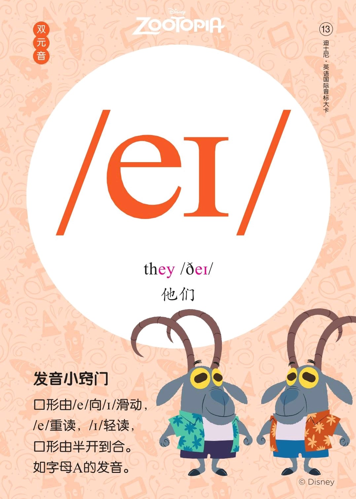
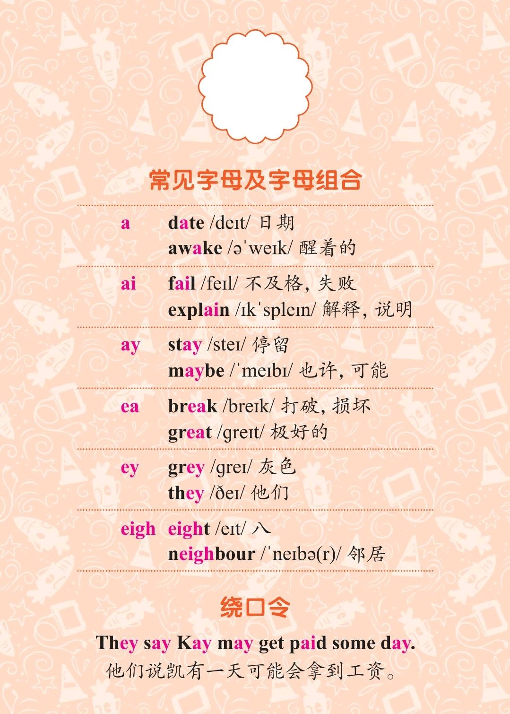
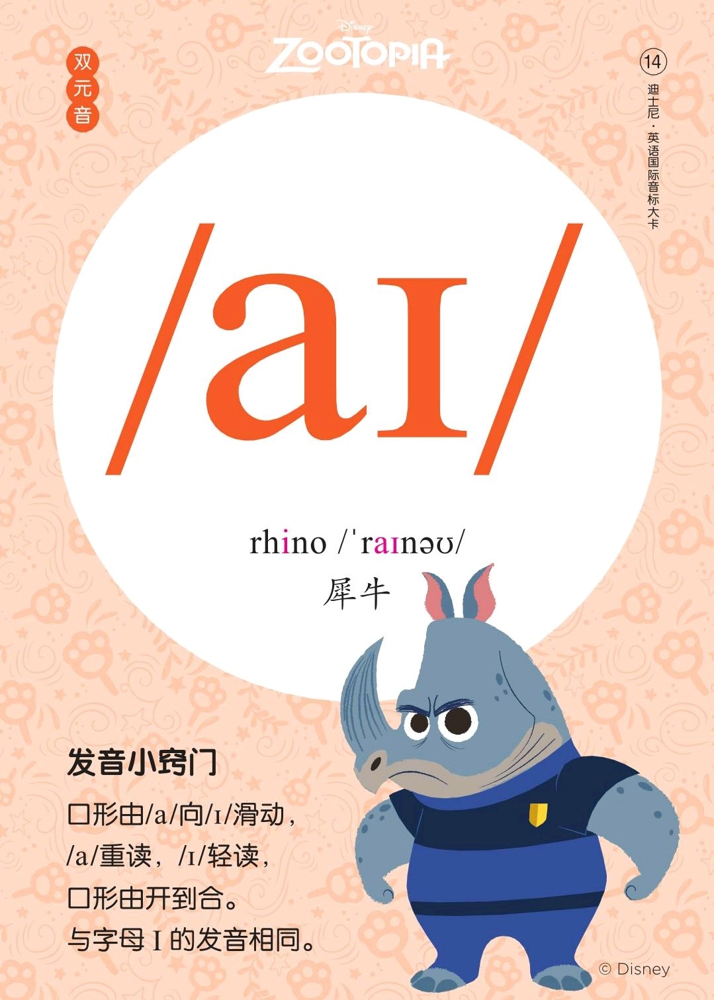
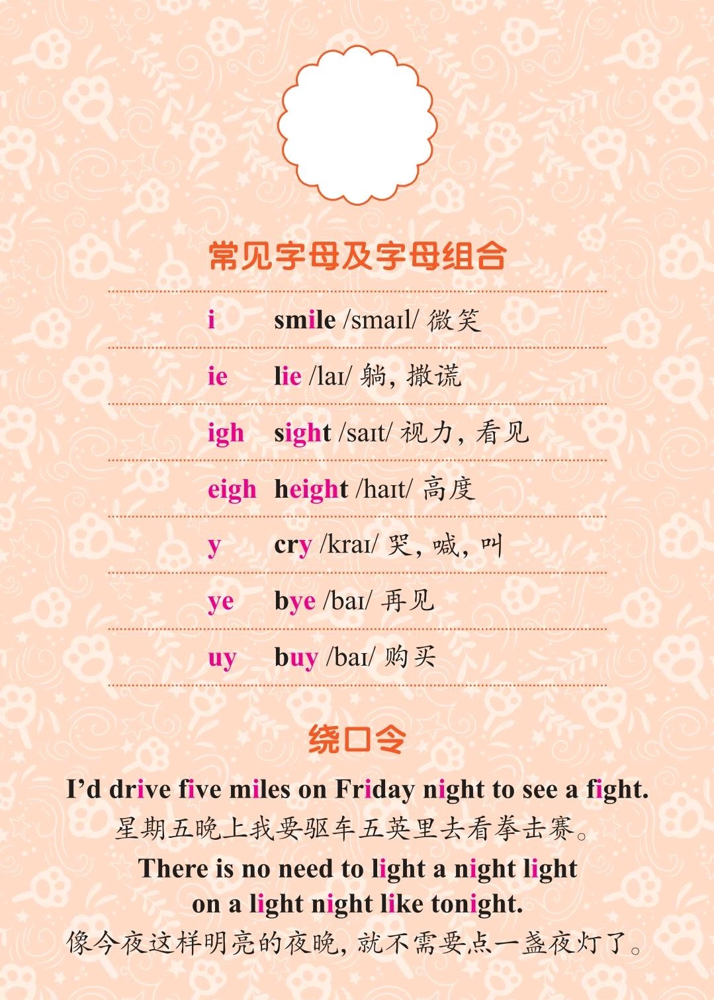

###### [返回到主页](README.md)

# 第七讲 双元音[eɪ]和双元音[aɪ] 

|   ID|IPA     |KK     |IPA63 |
|:---:|:-------|:------|:-----|
|   13|**[eɪ]**|**[eɪ]**|`[ei]`|
|   14|**[aɪ]**|**[aɪ]**|`[ai]`|
-------------------------------------------------------------------------------
|||
|:--------------------------:|:--------------------------:|
|||
|||
|||

## 1 - 双元音[eɪ]

### 1.1 发音方法
* 发音由[e]向[ɪ]自然滑动，滑动过程中口型由半开到半合，舌位随之抬高。
* 发此音时注意把音发足，与字母A的发音相同。

## 2 - 双元音[aɪ]

### 2.1 发音方法
* 发音由[a]向[ɪ]自然滑动，滑动过程中口型由开到合。
* 发此音时注意把音发足，与字母I的发音相同。

## 3 - 参考资料
* [Rachel's English][C01]
  * [English: How to Pronounce AY [eɪ] Diphthong][C02]
  * [English: How to Pronounce AI [aɪ] Diphthong][C03]

[C01]: https://rachelsenglish.com/
[C02]: https://rachelsenglish.com/english-pronounce-ay-diphthong/ 
[C03]: https://rachelsenglish.com/english-pronounce-ai-diphthong/ 

###### [返回到主页](README.md)
