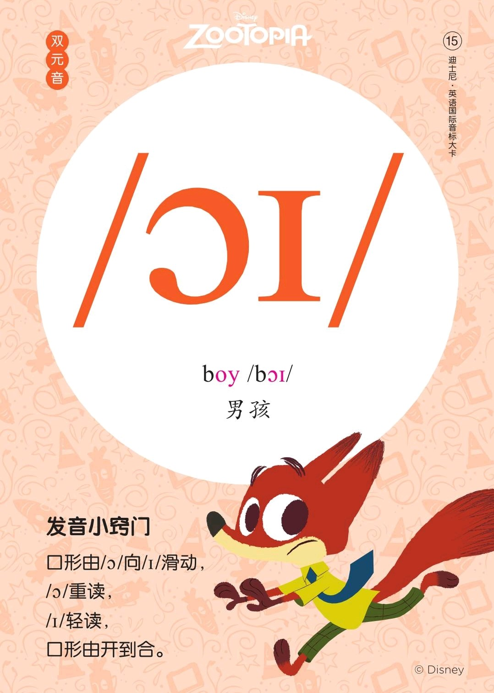

###### [返回到主页](README.md)

# 第八讲 双元音[ɔɪ]和双元音[əʊ]

|   ID|IPA     |KK     |IPA63 |
|:---:|:-------|:------|:-----|
|   15|**[ɔɪ]**|**[ɔɪ]**|`[ɔi]`|
|   16|**[əʊ]**|`[oʊ]`  |`[əu]`|
-------------------------------------------------------------------------------
|||
|:--------------------------:|:--------------------------:|
|||
|||
|||

## 1 - 双元音[ɔɪ]

### 1.1 发音方法
* 发音由[ɔ]向[ɪ]自然滑动，但不到舌位就停止了；
* 滑动的过程中双唇逐渐由圆变扁，口型由大到小。

## 2 - 双元音[əʊ]

### 2.1 发音方法
* 发音由[ə]向[ʊ]自然滑动，滑动过程中，口型逐渐由半开到小而圆，舌位由半低到高。

## 3 - 参考资料
* [Rachel's English][C01]
  * [English: How to Pronounce OY [ɔɪ] Diphthong][C02]
  * [English: How to Pronounce OH [oʊ] Diphthong][C03]

[C01]: https://rachelsenglish.com/
[C02]: https://rachelsenglish.com/english-pronounce-oy-diphthong/
[C03]: https://rachelsenglish.com/english-pronounce-oh-diphthong/

###### [返回到主页](README.md)
