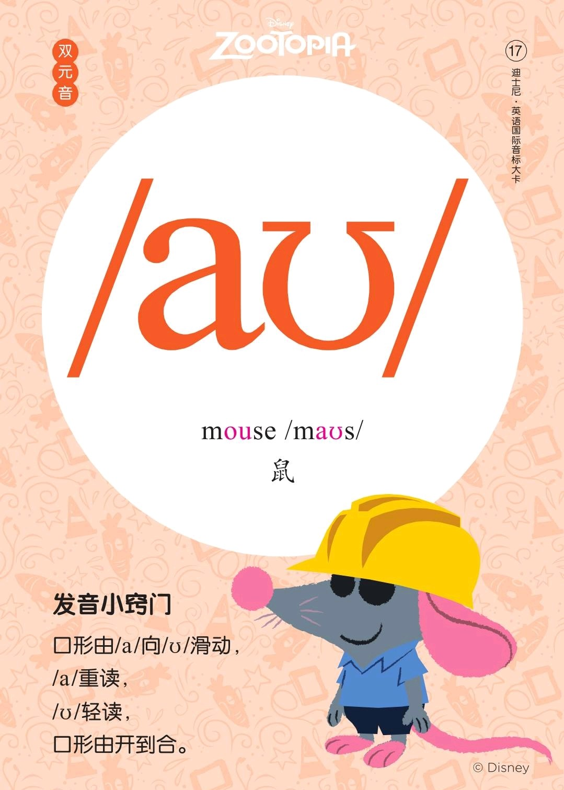
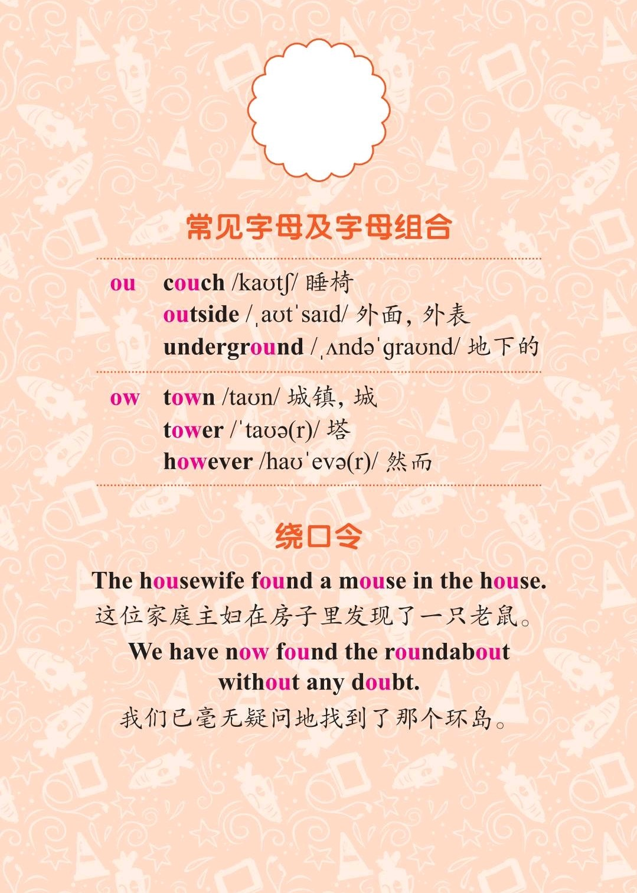
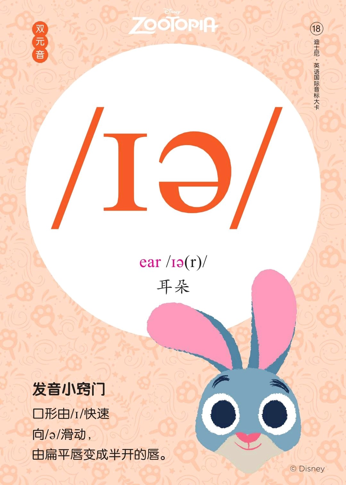

###### [返回到主页](README.md)

# 第九讲 双元音[aʊ]和双元音[ɪə]

|   ID|IPA     |KK     |IPA63 |
|:---:|:-------|:------|:-----|
|   17|**[aʊ]**|**[aʊ]**|`[au]`|
|   18|**[ɪə]**|[ɪɹ]    |`[iə]`|
-------------------------------------------------------------------------------
|||
|:--------------------------:|:--------------------------:|
|||
|||
|||

## 1 - 双元音[aʊ]

### 1.1 发音方法
* 将口张开略圆，逐渐合拢，双唇逐渐成圆形，不要一开始就把双唇收圆；
* 发音时由[a]向[ʊ]自然滑动，滑动过程中双唇收拢收圆，口型由大到小，舌位由低到高。

## 2 - 双元音[ɪə]

### 2.1 发音方法
* 发音时由[ɪ]向[ə]自然滑动，滑动过程中发音较清楚，发音较弱，双唇始终半开。

## 3 - 参考资料
* [Rachel's English][C01]
  * [English: How to Pronounce OW [aʊ] Diphthong][C02]

[C01]: https://rachelsenglish.com/
[C02]: https://rachelsenglish.com/english-pronounce-ow-diphthong/ 

###### [返回到主页](README.md)
