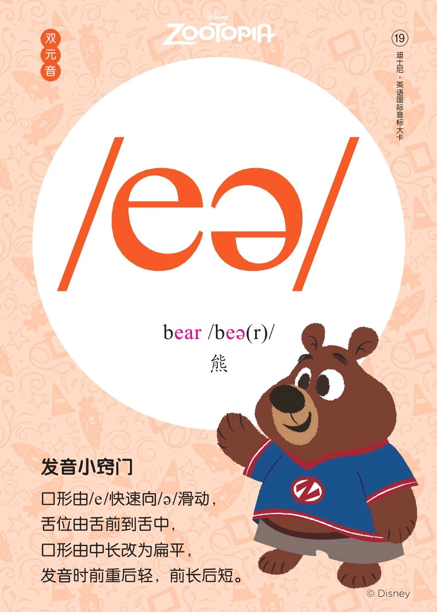
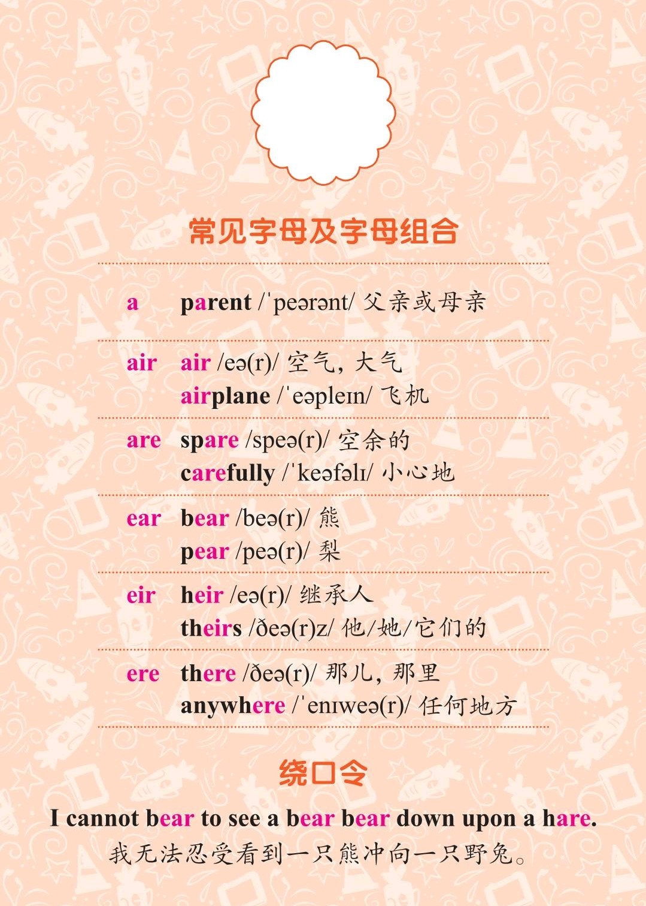
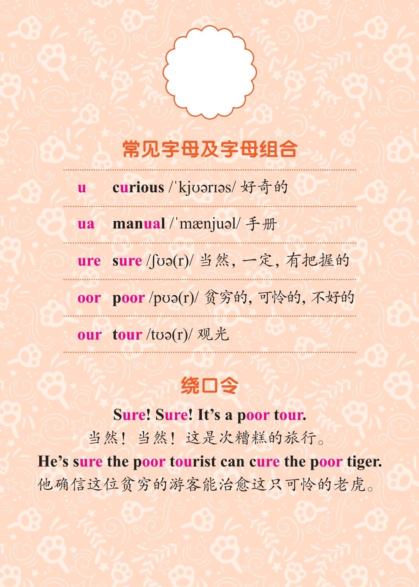

###### [返回到主页](README.md)

# 第十讲 双元音[eə]和双元音[ʊə]

|   ID|IPA     |KK     |IPA63 |
|:---:|:-------|:------|:-----|
|   19|**[eə]**|[eɹ]   |`[ɛə]`|
|   20|**[ʊə]**|[ʊɹ]   |`[uə]`|
-------------------------------------------------------------------------------
|||
|:--------------------------:|:--------------------------:|
|||
|||
|||

## 1 - 双元音[eə]

### 1.1 发音方法
* 发音时由[e]向[ə]快速滑动，滑动过程中口形由中长变为扁平；
* 双唇张开后略圆，牙床张开一定宽度，舌尖卷上慢慢卷后。

## 2 - 双元音[ʊə]

### 2.1 发音方法
* 发音时由[ʊ]向[ə]快速滑动，滑动过程中口形由收圆变为半开。

## 3 - 参考资料
* [Rachel's English][C01]

[C01]: https://rachelsenglish.com/

###### [返回到主页](README.md)
