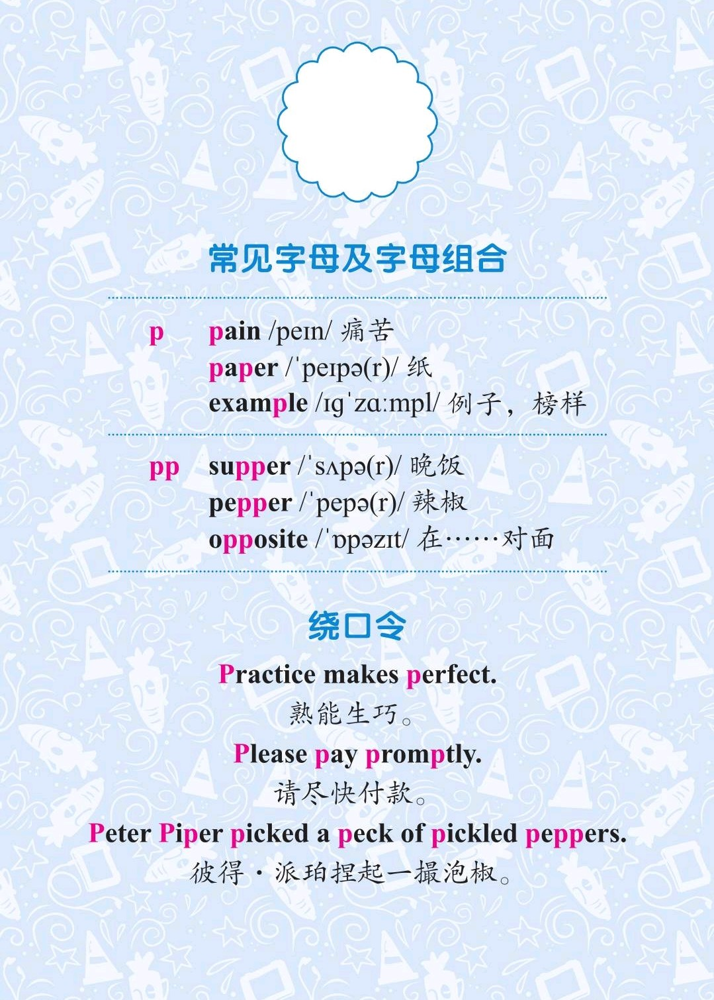

###### [返回到主页](README.md)

# 第十一讲 爆破音[p]和爆破音[b]

|   ID|IPA     |KK     |IPA63 |
|:---:|:-------|:------|:-----|
|   21|**[p]** |[p]    |[p]|
|   22|**[b]** |[b]    |[b]|
-------------------------------------------------------------------------------
|||
|:--------------------------:|:--------------------------:|
|||
|||
|||

## 1 - 爆破音[p]

### 1.1 发音方法
* 发音时双唇闭紧，气流突然冲开双唇，冲出口腔；
* [p]是清辅音，声带不震动。

## 2 - 爆破音[b]

### 2.1 发音方法
* 发音时双唇闭紧，然后突然放开，使气流突破双唇外泄；
* [b]是浊辅音，声带震动。

### 2.2 音标特征
* 双唇爆破浊辅音

## 3 - 参考资料
* [Rachel's English][C01]
  * [English: How to Pronounce B [b] and P [p] Consonants][C02]

[C01]: https://rachelsenglish.com/
[C02]: https://rachelsenglish.com/english-pronounce-b-p-consonants/

###### [返回到主页](README.md)
