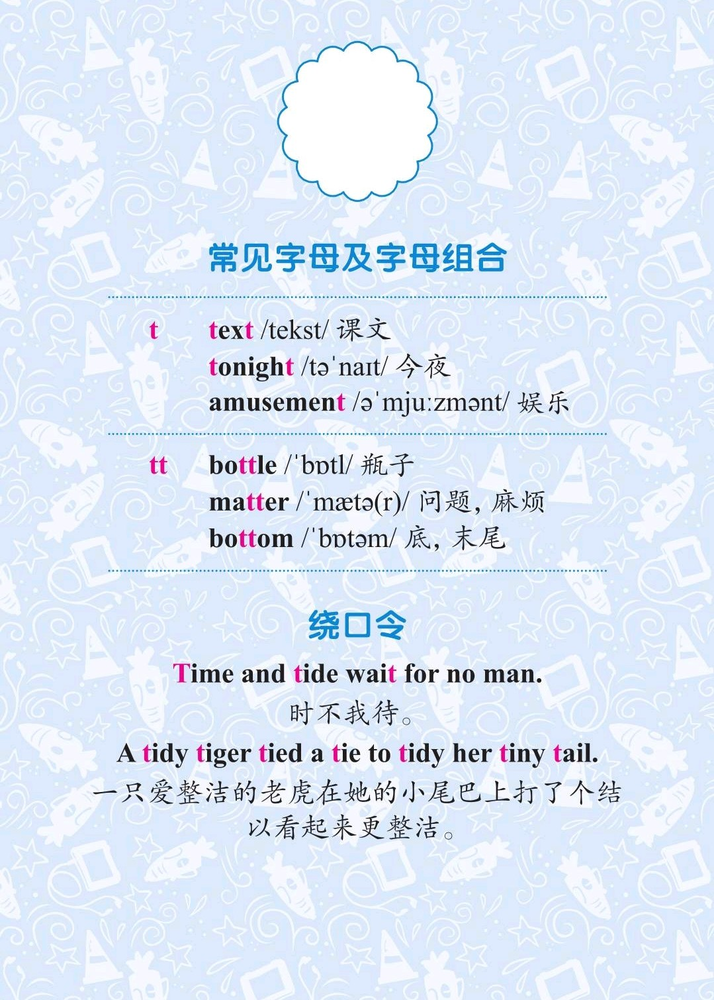
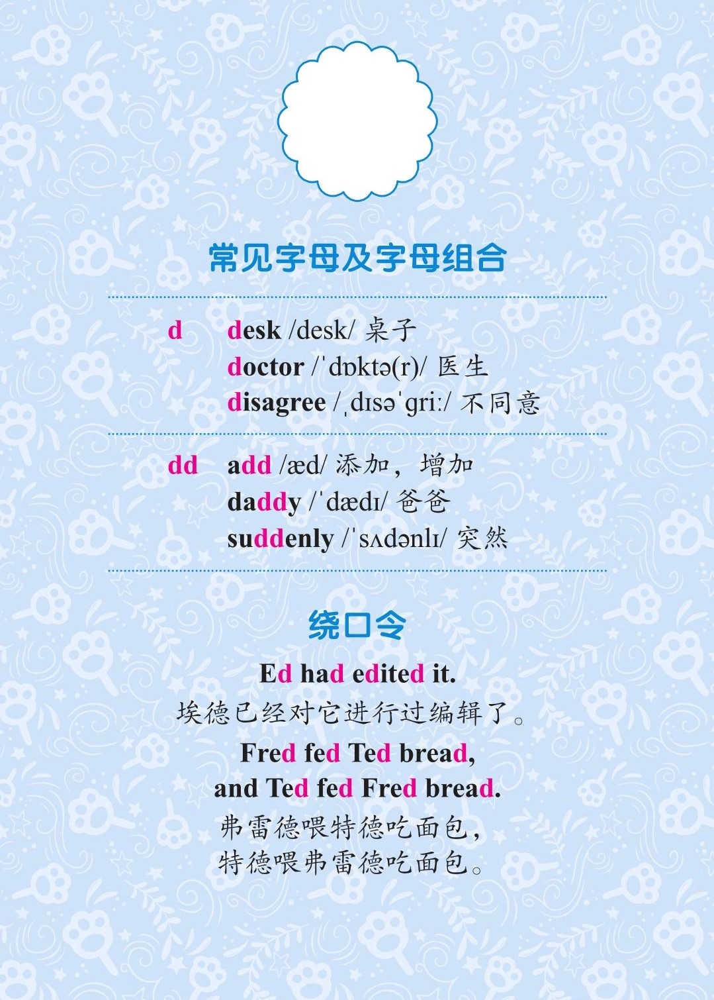

###### [返回到主页](README.md)

# 第十二讲 爆破音[t]和爆破音[d]

|   ID|IPA     |KK     |IPA63 |
|:---:|:-------|:------|:-----|
|   23|**[t]** |[t]    |[t]|
|   24|**[d]** |[d]    |[d]|
-------------------------------------------------------------------------------
|||
|:--------------------------:|:--------------------------:|
|||
|||
|||

## 1 - 爆破音[t]

### 1.1 发音方法
* 双唇微开，先用舌尖紧贴上齿龈，形成阻碍，然后突然下降，气流冲出口腔；
* [t]是清辅音，声带不震动；
* **注意**: 在[s]音的后边，[t]要读成相应的浊辅音[d]。

## 2 - 爆破音[d]

### 2.1 发音方法
* 双唇微开，先用舌尖紧贴上齿龈，形成阻碍，然后突然下降，气流冲出口腔；
* [d]是浊辅音，声带震动。

## 3 - 参考资料
* [Rachel's English][C01]
  * [English: How to Pronounce T and D between Consonants][C02]

[C01]: https://rachelsenglish.com/
[C02]: https://rachelsenglish.com/pronounce-t-d-consonants/

###### [返回到主页](README.md)
