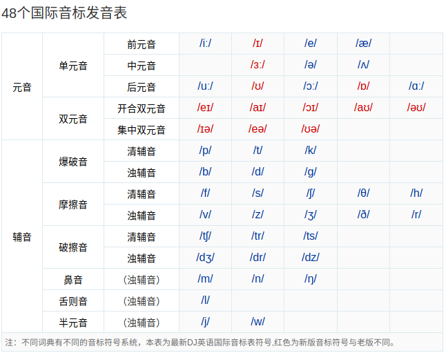
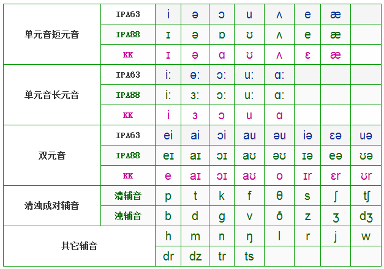

# 英语国际音标(IPA88)

## 1 - 英英和美英

* 英英使用DJ音标，美音采用KK音标；
* 英式英语不卷舌，读起来比较轻松；美式英语卷舌比较多。

> e.g.

|单词|英式英语|美式英语|含义|
|:---|:------:|:------:|:---|
|ever   |['evə]      |['evər]     |adv. 曾经|
|better |['betə]     |['betər]    |adj. 较好的；adv. 较好地|
|river  |['rɪvə]     |['rɪvər]    |n. 河流|
|chance |[tʃɑːns]    |[tʃæns]     |n. 机会|
|tomato |[tə'mɑːtəʊ] |[tə'meɪtoʊ] |n. 西红柿|
|student|['stjuːdnt] |['stuːdnt]  |n. 学生|
|fast   |[fɑːst] 　  |[fæst]      |adj. 快的|

> 有关IPA, DJ和KK，请参考文章[IPA、DJ、KK音标的起源和联系区别][101]。

[101]: http://blog.sina.com.cn/s/blog_a3f822610101ikhl.html

## 2 - [字母的读法](//www.bilibili.com/video/av20864932?p=1)

* 字母是音标的基础，只有掌握了字母的标准发音，才能沟让英语的发音更加准确。
* 元音字母有A, E, I, O, U五个，其他则为辅音字母。

|字母 |IPA音标       |   |字母 |IPA音标       |   |字母 |IPA音标       |
|:----|:-------------|---|:----|:-------------|---|:----|:-------------|
| A a |[**ei**]      |   | B b |[**bi:**]     |   | C c |[**si:**]     |
| D d |[**di:**]     |   | E e |[**i:**]      |   | F f |[**ef**]      |
| G g |[**dʒi:**]    |.  | H h |[**eit∫**]    |   | I i |[**ai**]      |
| J j |[**dʒei**]    |   | K k |[**kei**]     |   | L l |[**el**]      |
| M m |[**em**]      |   | N n |[**en**]      |.  | O o |[**əu**]      |
| P p |[**pi:**]     |   | Q q |[**kju:**]    |   | R r |[**ɑ:**]      |
| S s |[**es**]      |   | T t |[**ti:**]     |.  | U u |[**ju:**]     |
| V v |[**vi:**]     |   | W w |[**′d∧blju:**]|.  | X x |[**eks**]     |
| Y y |[**wai**]     |   | Z z |[**zi:**]     |   |     |              |

## 3 - 48个国际音标

**声明**：因为本人最早接触的国际音标为*IPA63*, 故这里以**IPA88**作为学习指南。

### 3.1 学习音标的方法
1. 遵循“少即是多”的原则，每天学习一到两个音标；
1. 对照视频，反复模仿；
1. 针对含有该音标的单词，不断强化训练。

### 3.2 [48个国际音标音标概览](https://en-yinbiao.xiao84.com/yinbiaofayin/)
||
|:----------------------:|
||
||
||

#### 3.2.1 元音
* 发音时声带振动，呼出的气流通过口腔时不受阻碍，这样形成的语音称为**元音**。 

#### 3.2.1 辅音 
* 不论声带振动与否，发音时呼出的气流通过口腔或鼻腔时受到一定的阻碍，这样形成的
  语音称为**辅音**；
* 发音时声带不振动的辅音称为**清辅音**；
* 发音时声带振动的辅音称为**浊辅音**。

### 3.3 48个国际音标详解

* [第一讲 单元音[i:]和单元音[ɪ]](01.md)
* [第二讲 单元音[e]和单元音[æ]](02.md)
* [第三讲 单元音[ɜ:]和单元音[ə]](03.md)
* [第四讲 单元音[ʌ]和单元音[ɑ:]](04.md)
* [第五讲 单元音[ɔ:]和单元音[ɒ]](05.md)
* [第六讲 单元音[u:]和单元音[ʊ]](06.md)
* [第七讲 双元音[eɪ]和双元音[ɑɪ]](07.md)
* [第八讲 双元音[ɔɪ]和双元音[əʊ]](08.md)
* [第九讲 双元音[ɑʊ]和双元音[ɪə]](09.md)
* [第十讲 双元音[eə]和双元音[ʊə]](10.md)
* [第十一讲 爆破音[p]和爆破音[b]](11.md)
* [第十一讲 爆破音[t]和爆破音[d]](12.md)
* [第十三讲 爆破音[k]和爆破音[g]](13.md)
* [第十四讲 摩擦音[f]和摩擦音[v]](14.md)
* [第十五讲 摩擦音[θ]和摩擦音[ð]](15.md)
* [第十六讲 摩擦音[s]和摩擦音[z]](16.md)
* [第十七讲 摩擦音[ʃ]和摩擦音[ʒ]](17.md)
* [第十八讲 摩擦音[r]和摩擦音[h]](18.md)
* [第十九讲 破擦音[ʧ]和破擦音[ʤ]](19.md)
* [第二十讲 破擦音[tr]和破擦音[dr]](20.md)
* [第二十一讲 破擦音[ts]和破擦音[dz]](21.md)
* [第二十二讲 鼻音[m]、鼻音[n]和鼻音[ŋ]](22.md)
* [第二十三讲 舌侧音[l]](23.md)
* [第二十四讲 半元音[w]和半元音[j]](24.md)
