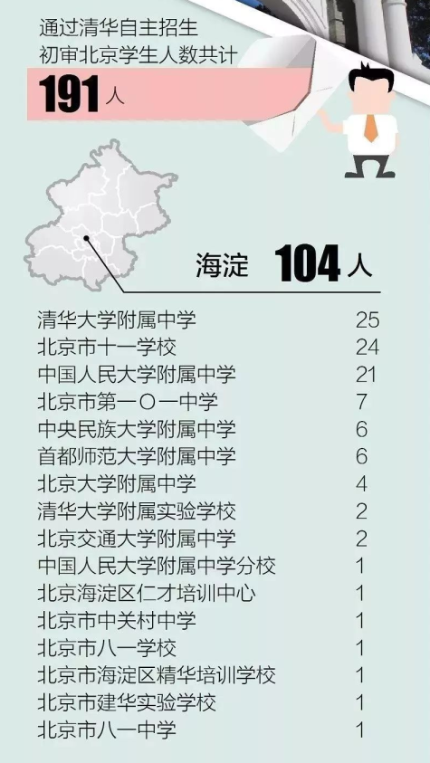
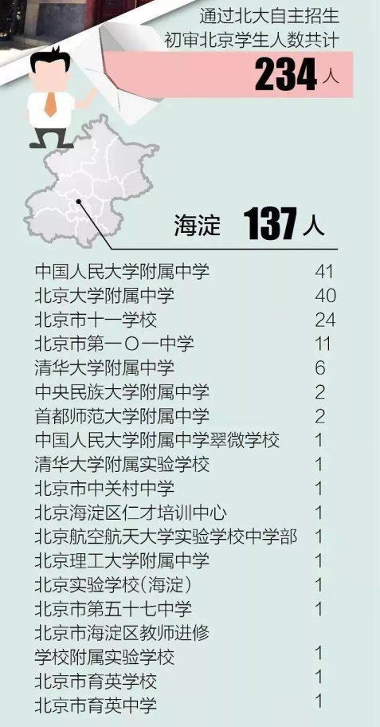
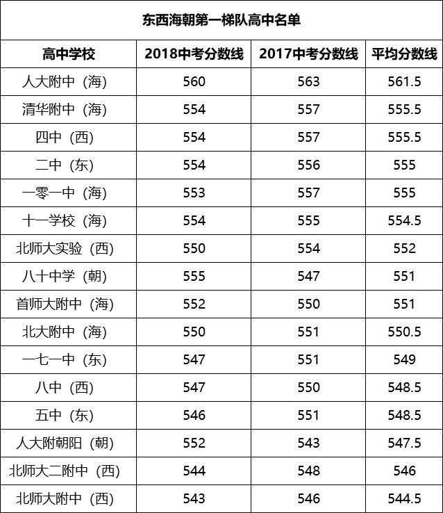
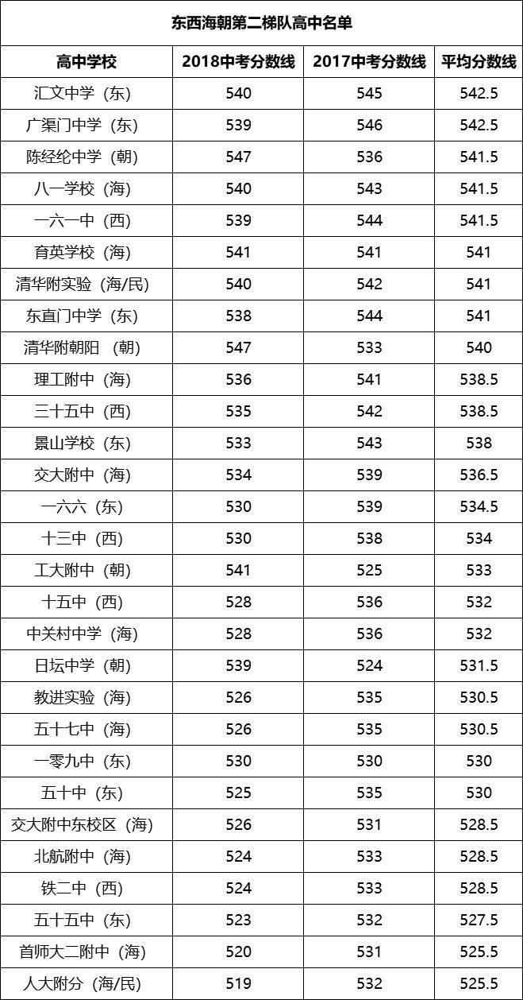
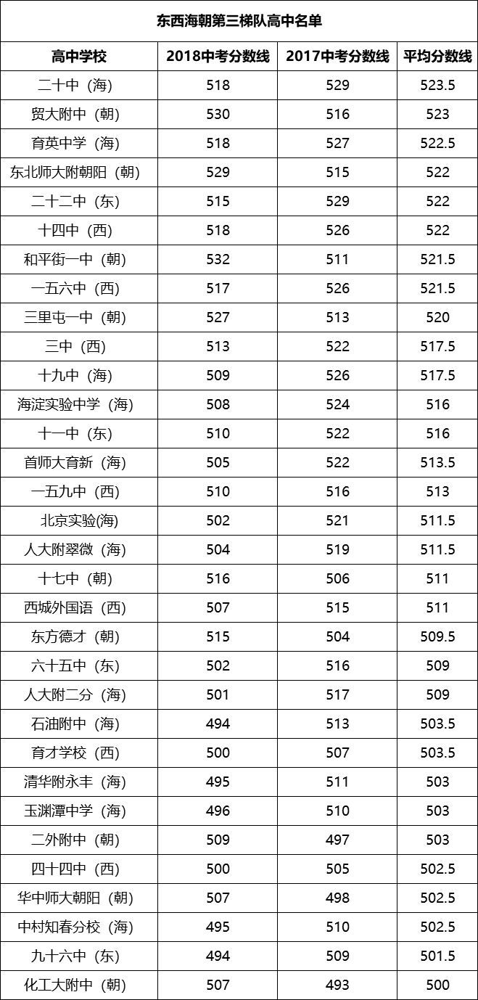
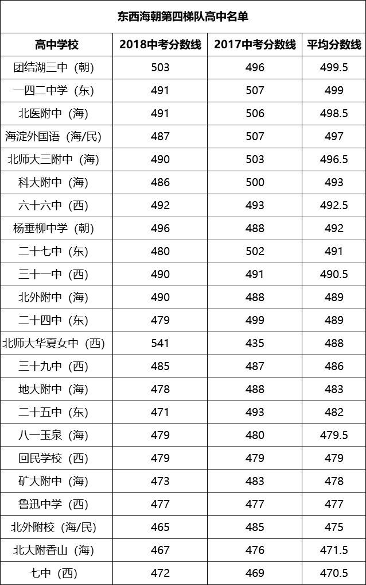

## [北京高中排名(2019)](http://www.upkao.com/gk/77277.html)

### 1A (海淀)第一梯队
* 01 人大附中
* 02 北大附中
* 03 清华附中
* 04 **101中学**
* 05 首师大附中
* 06 十一学校

### 1B (海淀)第二梯队
* 07 北京理工大学附属中学 (理工大附中)
* 08 北京交通大学附属中学 (交大附中)
* 09 **中关村中学**
* 10 **八一学校** (i.e. `八一中学`) [1]
* 11 北京市育英中学       (育英中学)
* 12 北京市第二十中学     (二十中)
* 13 北京市第五十七中学   (五十七中)
* 14 海淀区教师进修学校附属实验学校 (海淀教进附中)

[1] 八一中学就是八一学校，现在就叫八一学校，小学中学在一起，
    上八一小学直升八一中学，九年一贯制

NOTE: **十九中不在这两个梯队里**。

### 2A (西城)第一梯队
* 01 北京四中
* 02 北师大附属实验中学
* 03 北京八中
* 04 北师大二附中
* 05 北师大附中

### 2B (西城)第二梯队
* 06 一六一
* 07 35中
* 08 铁二中
* 09 十三中学
* 10 十五中学

### 3A (东城)第一梯队
* 01 二中
* 02 五中
* 03 一七一
* 04 汇文中学
* 05 广渠门
* 06 东直门

### 3B (东城)第二梯队
* 07 十一中学
* 08 五十中学
* 09 五十五中学
* 10 一六六
* 11 景山学校

### 4A (朝阳区)第一梯队
* 01 第一梯队
* 02 八十中学
* 03 人大附中朝阳学校
* 04 清华附中朝阳学校
* 05 陈经纶中学

### 4B (朝阳区)第二梯队
* 06 工业大学附属中学
* 07 日坛中学
* 08 和平街一中
* 09 对外经贸附属中学
* 10 东北师范大学附属朝阳学校

## 附录一 [2018北京各中学通过北清自主招生初审人数](http://www.sohu.com/a/232639692_100169338)

### A11 (清华->海淀)

### A12 (北大->海淀)

## 附录一 [2018北京高中大排名](https://www.sohu.com/a/277527173_556566)

### A21 第一梯队

* 依据：中考统招普通班录取分数线平均保持在544分以上；
* 第一梯队中学校几乎被海淀和西城垄断，这些学校的一本率均保持在98%以上，
  平均分都在600分以上，大量学生考入国内名校甚至世界名校，清北统考录取
  的北京生源95%以上来自以下中学。大家常说的"海淀六小强"、"西城四金刚"
  都在这个梯队里。

### A22 第二梯队

* 依据：中考统招普通班录取分数线平均保持在525分以上；
* 这一梯队的学校主要以东西海朝的区重点为主，比如大家所熟知的汇文中学、
  广渠门中学、陈经纶中学、八一学校、育英学校等，高考一本率均保持在90%以上，
  大部分高考平均分在600分以上。

### A23 第三梯队
* 依据：中考统招普通班录取分数线平均保持在500分以上；
* 第三梯队的高中高考普遍会在一本线上，高考一本率保持在约70%以上，
  二本几乎95%上。

### A24 第四梯队
* 依据：中考统招普通班录取分数线平均保持在470分以上；
* 第四梯队的高中在东西海朝数量还是很多的，最后考上一本的比例不高，
  考上二本线比例较大。

