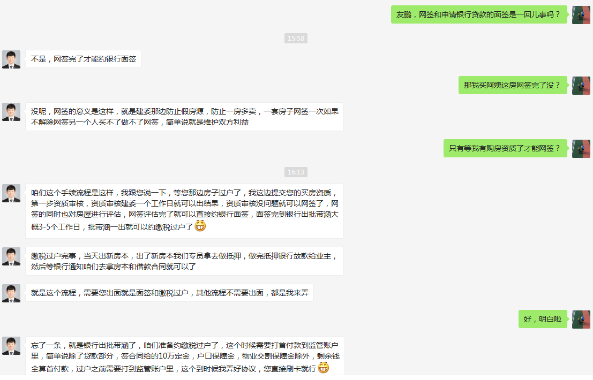

# 1 - From `龙六` to `双西二`

## 1.1 - 龙六

| # |标志|    条目| 金额|余额|说明|
|-- |  --|      --|   --|  --|  --|
|A1 |<---|成交价  |  +420| 420|05/25/2019|
|B1 |--->|户口押金|   -10| 410|==>JIU's 4th 10W|
|B1b|--->|舅4th利息|   -1| 409|JIU's 4th 10W+1W|
|B2 |--->|交行欠款|   -67| 342|06/19/2019|
|A2 |<---|吕固五  |   +20| 362|吕固五|
|A3 |<---|Kaiba   |   +21| 383|Kaiba's Cash 06/25/2019|
|A4 |<---|招18    |   +18| 401|招18现金分期 06/05/2019|

## 1.2 - 双西二

| # |标志|    条目| 金额| 余额|说明|
|-- |  --|      --|   --|   --|  --|
|A1 |--->|成交价  |  575|575.0|05/19/2019|
|A2 |--->|个税    |  5.5|580.5|个税1%, 满五不唯一, = 575 * 95% * 1%|
|A3 |--->|契税    |  5.5|586.0|契税1%, = 575 * 95% * 1%|
|A4 |--->|中介费  | 14.7|600.7|中介费, = 575 * 2.7% * 95%|
|A5 |--->|MEM学费 |  8.4|609.1|MEM学费2019, 08/19/2019|
|A5b|--->|MEM移动课堂|3.0|612.1|MEM移动课堂, 10/01/2019|
|A6 |--->|装修资金| 20.0|632.1|装修资金, 11/01/2019|
|B1 |<---|贷款    |-218 |414.1|贷款218|
|B2 |<---|可用现金|-401 | 13.1|**可用现金401** `01.A4`|

```Python
>>> 632.1 - 218 - 401 = 13.1 ~= 13 # <<< 装修资金缺口
```
> Q: 装修资金缺口如何填补?
> A: 请参见 [PlanB](08Next36MPlanB.md)

# 2 - MILESTONE

|     #|             事件|计划时间点|完成时间点|备注|
|------|               --|        --|        --|  --|
|~~01~~|新房成交     |05/31/2019|05/19/2019|    |
|~~02~~|旧房成交     |06/15/2019|05/25/2019|    |
|~~03~~|交行提前还款 |06/10/2019|06/10/2019|    |
|~~04~~|旧房查户口   |NA        |05/27/2019|    |
|~~05~~|旧房银行面签 |NA        |05/29/2019|    |
|~~06~~|**旧房交行解押** |06/12/2019|07/02/2019|电话：010-65869815|
|~~07~~|操作满五唯一(1)  |06/28/2019|06/25/2019|(1) 海淀|
|~~08~~|操作满五唯一(2)  |06/28/2019|06/29/2019|(2) 山东|
|~~09~~|**旧房建委解押** |06/17/2019|07/03/2019|    |
|~~10~~|**新房可以买卖确认**|06/19/2019|07/12/2019|    |
|**11**|旧房缴税         |08/01/2019|          |    |
|**12**|旧房过户         |08/01/2019|          |    |
|**13**|旧房水电气等结算 |08/01/2019|          |    |
|**14**|旧房收到所有款   |08/22/2019|          |工商银行望京支行|
|**15**|开收入证明       |07/08/2019|07/09/2019|    |
|**16**|打印银行流水     |07/09/2019|          |    |
|**17**|**买房资质审核申请**|08/02/2019|          |    |
|**18**|新房网签         |08/05/2019|          |    |
|**19**|新房银行面签     |08/06/2019|          |    |
|**20**|新房缴税         |08/12/2019|          |    |
|**21**|新房过户         |08/12/2019|          |    |
|**22**|新房水电气等结算 |08/12/2019|          |    |
|**23**|逆操作满五唯一(1)|08/16/2019|          |(1) 海淀|
|**24**|逆操作满五唯一(2)|08/18/2019|          |(2) 山东|
|**25**|**将户口从旧房迁到新房**|08/26/2019|          |    |
|**26**|新房装修         |09/09/2019|          |    |

* 买房操作流程

