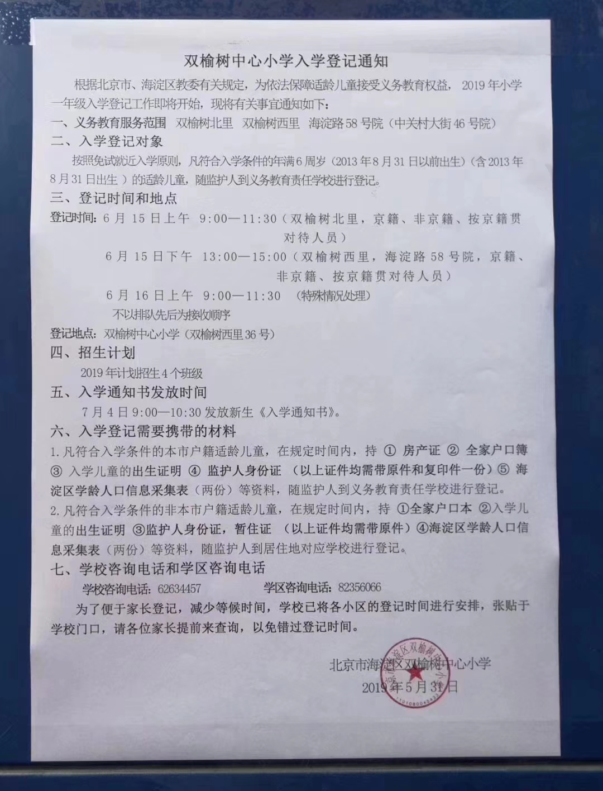

# 双西二风险应对策略

因双西二存在着央产房上市交易风险，故拟定应对策略如下：

## 2.1 龙六现金分析

| # | ITEM                   | NUM   |
|-- | --                     | --    |
| 1 |龙六                    | 420   |
| 2 |定金                    |  10   |
| 3 |户口押金(ToJiu)         |  10   |
| 4 |舍长120天               |  22   |
| 5 |MEM第一年学费(+移动课堂)|  10   |
| 6 |装修启动资金            |  10   |
| > |到九月底可用现金        |**358**|

## 2.2 双西二现金分析

| # | ITEM                   | NUM    |
|-- | --                     | --     |
| 1 | 定金                   | 10     |
| 2 | 中介费                 | 14.7   |
| > | 合计                   |**24.7**|

* NOTE: 这里的24.7可作为最终的交易费用 (契税+中介费)

## 2.3 Anti-RISK

* 可以考虑的房子的成交价范围在**575-605**之间
* 需要短期借入**10**作为周转以交付新看房定金

```Bash
###################################################################
# 358 + 24.7 = 382.7 ~= 383 # <<< TOTAL CASH AVAILABLE BY0930 <<< #
###################################################################

#bash$ ./fang 605 0.95 20 Y # ** 383 - 397 = -14
Raw total    =   605.00
Net total    =   574.75
Loan         =   229.00
Deed tax     =     5.75
Geshui       =     0.00
Zhongjiefee  =    15.52
Shoufu       =   397.00
XXCore       =    64.00
Yuegong(#20) = 16248.13
Yuegong(#25) = 14586.98

#bash$ ./fang 600 0.95 20 Y # **  383 - 383 = -10
Raw total    =   600.00
Net total    =   570.00
Loan         =   228.00
Deed tax     =     5.70
Geshui       =     0.00
Zhongjiefee  =    15.39
Shoufu       =   393.00
XXCore       =    60.00
Yuegong(#20) = 16177.18
Yuegong(#25) = 14523.28

#bash$ ./fang 595 0.95 20 Y # *** 383 - 390 = -7
Raw total    =   595.00
Net total    =   565.25
Loan         =   226.00
Deed tax     =     5.65
Geshui       =     0.00
Zhongjiefee  =    15.26
Shoufu       =   390.00
XXCore       =    56.00
Yuegong(#20) = 16035.28
Yuegong(#25) = 14395.88

#bash$ ./fang 590 0.95 20 Y # *** 383 - 387 = -4
Raw total    =   590.00
Net total    =   560.50
Loan         =   224.00
Deed tax     =     5.61
Geshui       =     0.00
Zhongjiefee  =    15.13
Shoufu       =   387.00
XXCore       =    53.00
Yuegong(#20) = 15893.37
Yuegong(#25) = 14268.49

#bash$ ./fang 585 0.95 20 Y # **** 383 - 384 = -1
Raw total    =   585.00
Net total    =   555.75
Loan         =   222.00
Deed tax     =     5.56
Geshui       =     0.00
Zhongjiefee  =    15.01
Shoufu       =   384.00
XXCore       =    50.00
Yuegong(#20) = 15751.47
Yuegong(#25) = 14141.09

#bash$ ./fang 580 0.95 20 Y # ***** 383 - 381 = +2
Raw total    =   580.00
Net total    =   551.00
Loan         =   220.00
Deed tax     =     5.51
Geshui       =     0.00
Zhongjiefee  =    14.88
Shoufu       =   381.00
XXCore       =    47.00
Yuegong(#20) = 15609.56
Yuegong(#25) = 14013.69
```

# 北京市双榆树中心小学2019年入学登记通知

