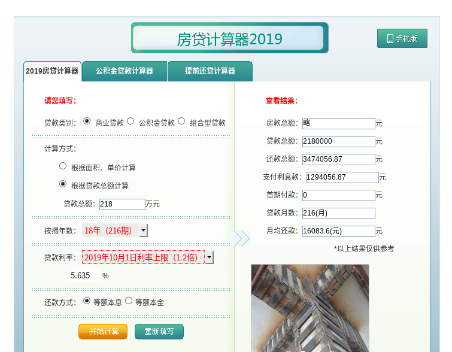
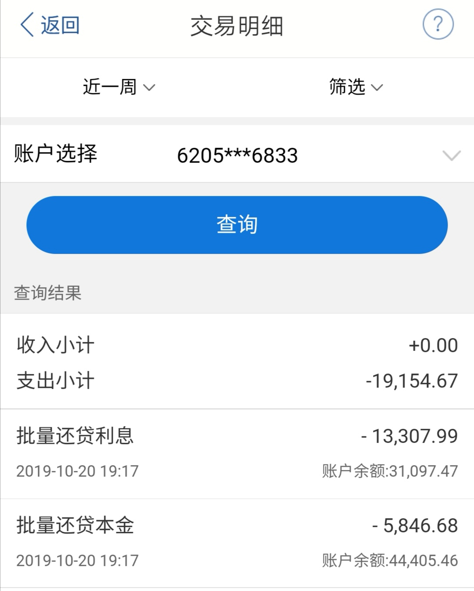

# 贷款218万

* 贷款年限：18年
* 利率： 4.9% * 1.15 = 5.635%
* 贷款类型：等额本息
* 10/20月供EXP: 16083.60, but GOT: 19154.67 = 5846.68(本金) + 13307.99(利息)

### Q: 为什么首次还款多扣了3000+? (19154.67 - 16083.6 = 3071.06 ~= 3071)

## 0. 商业贷款计算器计算的月供

## 1. (手机银行)10月20日扣款明细

## 2. (手机银行)未来三个月还款计划

##### 查询电话: 010-57610371
